# Manuel Réseau Complet – Focus Cloud & Wi-Fi

**© Roadmvn – Tous droits réservés**

---

## Table des matières

### [Introduction générale](#introduction-generale)

### Chapitres principaux

1. [Introduction générale](#chapitre-01-introduction-generale)
2. [Fondamentaux réseau (OSI / TCP-IP, binaire, CIDR)](#chapitre-02-fondamentaux-reseau)
3. [Matériel & topologies (switch, routeur, firewall, câblage)](#chapitre-03-materiel-topologies)
4. [**Cloud Networking** (VPC, peering, security groups, LB)](#chapitre-04-cloud-networking) ← **Focus**
5. [**Wi-Fi** (802.11, WPA3, roaming, contrôleurs)](#chapitre-05-wifi) ← **Focus**
6. [Adressage IPv4 & IPv6 (VLSM, plan d'adressage)](#chapitre-06-adressage-ipv4-ipv6)
7. [Routage (statique, OSPF, BGP, VRF)](#chapitre-07-routage)
8. [VLAN & 802.1Q (trunk, access, VTP)](#chapitre-08-vlan-8021q)
9. [NAT & PAT (source, destination, hair-pin)](#chapitre-09-nat-pat)
10. [VPN (IPsec, WireGuard, SSL)](#chapitre-10-vpn)
11. [Services réseau (DHCP, DNS, NTP, LDAP, RADIUS)](#chapitre-11-services-reseau)
12. [Sécurité réseau (ACL, firewall stateful, IDS/IPS, segmentations)](#chapitre-12-securite-reseau)
13. [Supervision & logging (SNMP, NetFlow, ELK)](#chapitre-13-supervision-logging)
14. [Automatisation (Ansible, Netmiko, Nornir)](#chapitre-14-automatisation)
15. [Pentest réseau (scan, enum, MITM, pivot)](#chapitre-15-pentest-reseau)
16. [Annexes : lexique, check-lists, références](#chapitre-16-annexes)

### Guides pratiques

- [Guide d'import OVA dans Proxmox & VirtualBox](#guide-import-ova)
- [Examen final (50 questions)](#examen-final)

### Labs pratiques

Chaque chapitre inclut des labs pratiques basés sur des **OVA Ubuntu Server 22.04** prêtes à l'emploi, avec liens de téléchargement et hachages SHA-256 pour vérification d'intégrité.

---

## Introduction générale

### À propos de ce manuel

Ce manuel réseau complet a été conçu pour accompagner les professionnels IT dans leur progression, du niveau débutant jusqu'à l'expertise avancée. Avec un focus particulier sur les technologies **Cloud Networking** et **Wi-Fi**, ce guide pratique combine théorie solide et mise en application concrète à travers des laboratoires pratiques.

### Philosophie pédagogique

L'apprentissage des réseaux informatiques nécessite une approche progressive et méthodique. Ce manuel adopte une pédagogie en spirale, où chaque concept est d'abord introduit de manière simple, puis approfondi et mis en contexte avec les technologies modernes. L'accent est mis sur la compréhension des principes fondamentaux avant d'aborder les implémentations spécifiques.

### Public cible

Ce manuel s'adresse à plusieurs profils :

**Débutants en réseau** : Administrateurs système souhaitant élargir leurs compétences, développeurs découvrant l'infrastructure, étudiants en informatique cherchant une approche pratique.

**Professionnels intermédiaires** : Techniciens réseau voulant approfondir leurs connaissances cloud et Wi-Fi, ingénieurs système migrant vers le cloud, consultants IT nécessitant une mise à jour technologique.

**Experts cherchant la spécialisation** : Architectes réseau explorant les nouvelles approches cloud-native, spécialistes sécurité intégrant les enjeux réseau modernes, formateurs techniques recherchant du contenu structuré.

### Méthodologie d'apprentissage

Chaque chapitre suit une structure rigoureuse optimisée pour l'assimilation :

**Objectifs clairs** : Chaque section débute par des objectifs d'apprentissage mesurables, permettant au lecteur de savoir précisément ce qu'il va acquérir comme compétences.

**Visualisation conceptuelle** : Des schémas Mermaid illustrent chaque concept majeur, facilitant la compréhension des architectures et des flux de données.

**Explications détaillées** : Les concepts sont expliqués avec des analogies du monde réel, des exemples concrets et l'identification des pièges courants.

**Mise en pratique immédiate** : Chaque chapitre inclut un laboratoire pratique basé sur des machines virtuelles Ubuntu Server 22.04, permettant l'expérimentation en environnement contrôlé.

**Auto-évaluation** : Un QCM de 10 questions avec corrigé détaillé valide l'acquisition des connaissances avant de passer au chapitre suivant.

### Technologies couvertes

Ce manuel couvre l'ensemble de l'écosystème réseau moderne, avec une attention particulière aux domaines en forte évolution :

**Fondamentaux intemporels** : Modèles OSI et TCP/IP, adressage IP, routage, commutation, qui restent la base de toute expertise réseau.

**Cloud Networking (focus principal)** : Virtual Private Clouds (VPC), peering inter-VPC, security groups, load balancers, CDN, architectures multi-cloud et hybrides.

**Wi-Fi moderne (focus principal)** : Standards 802.11ax (Wi-Fi 6/6E), WPA3, roaming seamless, contrôleurs centralisés, Wi-Fi as a Service.

**Sécurité intégrée** : Segmentation réseau, firewalls nouvelle génération, détection d'intrusion, chiffrement bout-en-bout.

**Automatisation et observabilité** : Infrastructure as Code, monitoring proactif, analytics réseau, troubleshooting automatisé.

### Environnement de laboratoire

Les laboratoires pratiques reposent sur une approche standardisée garantissant la reproductibilité :

**Base technique unifiée** : Toutes les machines virtuelles utilisent Ubuntu Server 22.04 LTS, assurant la cohérence et la stabilité sur la durée.

**Hyperviseurs supportés** : Les OVA sont compatibles avec Proxmox (recommandé pour les environnements professionnels) et VirtualBox (idéal pour l'apprentissage personnel).

**Vérification d'intégrité** : Chaque OVA est accompagnée de son hachage SHA-256, permettant de vérifier l'authenticité et l'intégrité des fichiers téléchargés.

**Topologies évolutives** : Les labs commencent par des configurations simples (2-3 VMs) et évoluent vers des architectures complexes multi-sites.

### Prérequis techniques

Pour tirer le meilleur parti de ce manuel, certains prérequis sont recommandés :

**Connaissances de base** : Familiarité avec les systèmes Linux (ligne de commande, édition de fichiers, gestion des services), notions de base en informatique (processus, fichiers, réseau).

**Environnement matériel** : Machine hôte avec au minimum 16 GB de RAM (32 GB recommandés), 100 GB d'espace disque libre, processeur supportant la virtualisation (Intel VT-x ou AMD-V).

**Logiciels requis** : Hyperviseur (Proxmox ou VirtualBox), client SSH (OpenSSH, PuTTY), éditeur de texte avancé (VS Code, Vim), navigateur web moderne.

### Structure des évaluations

L'évaluation des connaissances s'articule autour de plusieurs niveaux :

**QCM par chapitre** : 10 questions ciblées validant la compréhension des concepts spécifiques, avec explications détaillées des bonnes et mauvaises réponses.

**Labs pratiques** : Exercices hands-on avec critères de validation objectifs (connectivité, configuration, sécurité), permettant de vérifier la maîtrise opérationnelle.

**Examen final** : 50 questions couvrant l'ensemble du programme, simulant les conditions d'une certification professionnelle.

### Évolution et maintenance

Ce manuel est conçu pour évoluer avec les technologies :

**Mises à jour régulières** : Les chapitres Cloud et Wi-Fi sont particulièrement suivis pour intégrer les dernières évolutions (nouveaux services cloud, standards Wi-Fi émergents).

**Retours d'expérience** : Les labs sont régulièrement testés et améliorés en fonction des retours des utilisateurs et de l'évolution des plateformes.

**Veille technologique** : Une attention particulière est portée aux technologies émergentes (SD-WAN, SASE, Wi-Fi 7) pour anticiper les futurs besoins de formation.

---


## Chapitre 01. Introduction générale

### Objectifs
- Comprendre l'évolution des réseaux informatiques et leur rôle central dans l'infrastructure moderne
- Maîtriser les enjeux spécifiques du Cloud Networking et du Wi-Fi dans le contexte actuel
- Appliquer une méthodologie d'apprentissage progressive pour acquérir une expertise réseau complète

### Schéma Mermaid
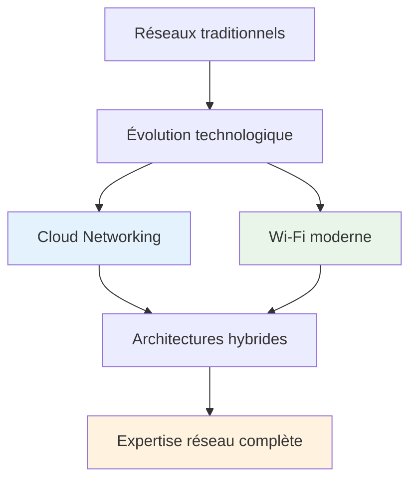

### Explications détaillées

#### L'évolution du paysage réseau

Les réseaux informatiques ont connu une transformation radicale au cours des deux dernières décennies. Alors que les architectures traditionnelles reposaient sur des équipements physiques dédiés et des topologies relativement statiques, l'émergence du cloud computing et la démocratisation du Wi-Fi ont fondamentalement redéfini les paradigmes réseau.

Cette évolution s'articule autour de plusieurs révolutions technologiques majeures. La virtualisation des fonctions réseau (NFV) a permis de découpler les services réseau du matériel propriétaire, ouvrant la voie à des architectures plus flexibles et économiques. Parallèlement, l'adoption massive des services cloud a créé de nouveaux besoins en termes de connectivité, de sécurité et de performance, nécessitant une approche repensée de la conception réseau.

Le Wi-Fi, initialement considéré comme une technologie d'appoint pour les connexions occasionnelles, est devenu un élément central de l'infrastructure réseau moderne. Avec l'avènement du Wi-Fi 6 et 6E, puis l'arrivée imminente du Wi-Fi 7, cette technologie offre désormais des performances comparables, voire supérieures, aux connexions filaires traditionnelles dans de nombreux scénarios d'usage.

#### Les défis du Cloud Networking

Le Cloud Networking représente bien plus qu'une simple migration des services vers des datacenters distants. Il s'agit d'une refonte complète de l'approche réseau, intégrant des concepts novateurs comme les Virtual Private Clouds (VPC), le peering inter-cloud, et les architectures multi-cloud.

Les défis techniques sont multiples et interconnectés. La latence devient un facteur critique dans un monde où les applications sont distribuées géographiquement, nécessitant une optimisation fine des chemins réseau et l'utilisation de technologies comme les Content Delivery Networks (CDN). La sécurité doit être repensée dans un modèle où le périmètre traditionnel de l'entreprise n'existe plus, donnant naissance aux concepts de Zero Trust Network Access (ZTNA) et de Secure Access Service Edge (SASE).

La gestion de la complexité constitue également un enjeu majeur. Les architectures cloud modernes peuvent impliquer des dizaines de VPC interconnectés, des centaines de security groups, et des milliers d'instances, nécessitant des outils d'automatisation et de monitoring sophistiqués pour maintenir la visibilité et le contrôle.

#### La révolution Wi-Fi

Le Wi-Fi moderne transcende largement sa fonction initiale de connectivité sans fil opportuniste. Les standards récents, notamment 802.11ax (Wi-Fi 6), introduisent des technologies avancées comme l'OFDMA (Orthogonal Frequency Division Multiple Access) et le MU-MIMO (Multi-User Multiple Input Multiple Output), permettant de servir efficacement des dizaines d'appareils simultanément.

L'intégration du Wi-Fi dans les stratégies réseau d'entreprise nécessite une approche architecturale sophistiquée. Les contrôleurs Wi-Fi centralisés permettent une gestion unifiée de centaines de points d'accès, avec des fonctionnalités avancées comme le load balancing automatique, la détection d'intrusion sans fil, et l'optimisation dynamique des canaux.

La sécurité Wi-Fi a également évolué de manière significative avec l'introduction de WPA3, qui adresse les vulnérabilités historiques des protocoles précédents tout en introduisant de nouvelles fonctionnalités comme l'authentification simultanée des égaux (SAE) et la protection contre les attaques par dictionnaire.

#### Convergence et synergie

L'un des aspects les plus fascinants de l'évolution réseau actuelle réside dans la convergence entre les technologies cloud et Wi-Fi. Les solutions Wi-Fi as a Service permettent de gérer des déploiements Wi-Fi globaux depuis des plateformes cloud, avec des capacités d'analytics et d'optimisation automatisée.

Cette convergence se manifeste également dans l'émergence d'architectures SD-WAN (Software-Defined Wide Area Network) qui intègrent seamlessly les connexions Wi-Fi, cellulaires et filaires dans une fabric réseau unifiée, optimisée dynamiquement en fonction des conditions de trafic et des politiques de sécurité.

### Exemples concrets

#### Architecture cloud moderne
```yaml
# Exemple de configuration Terraform pour VPC AWS
resource "aws_vpc" "main" {
  cidr_block           = "10.0.0.0/16"
  enable_dns_hostnames = true
  enable_dns_support   = true
  
  tags = {
    Name = "Production VPC"
    Environment = "prod"
  }
}

resource "aws_internet_gateway" "main" {
  vpc_id = aws_vpc.main.id
  
  tags = {
    Name = "Production IGW"
  }
}
```

#### Configuration Wi-Fi entreprise
```bash
# Configuration d'un contrôleur Wi-Fi Ubiquiti
# Création d'un réseau Wi-Fi sécurisé
configure
set wireless-networks WPA3-Enterprise security wpa3
set wireless-networks WPA3-Enterprise security group-rekey 3600
set wireless-networks WPA3-Enterprise security pairwise-rekey 3600
set wireless-networks WPA3-Enterprise radius auth-server 192.168.1.10
set wireless-networks WPA3-Enterprise radius auth-port 1812
set wireless-networks WPA3-Enterprise radius auth-secret "SecureRadius123"
commit
```

#### Monitoring réseau moderne
```bash
# Collecte de métriques réseau avec Prometheus
# Configuration pour surveiller la latence cloud
curl -X GET "https://monitoring.example.com/api/v1/query" \
  -G -d 'query=avg_over_time(ping_rtt_ms{target="aws-eu-west-1"}[5m])'

# Analyse du trafic Wi-Fi
iwconfig wlan0
iw dev wlan0 scan | grep -E "(SSID|signal|freq)"
```

### Lab pratique

#### Prérequis
- **OVA Ubuntu Server 22.04** : [https://releases.ubuntu.com/22.04/ubuntu-22.04.3-live-server-amd64.iso](https://releases.ubuntu.com/22.04/ubuntu-22.04.3-live-server-amd64.iso)
- **SHA-256** : `a4acfda10b18da50e2ec50ccaf860d7f20b389df8765611142305c0e911d16fd`
- **Hyperviseur** : Proxmox ou VirtualBox
- **RAM** : 2GB minimum par VM
- **Stockage** : 20GB par VM
- **Réseau** : Interface bridge ou NAT selon l'hyperviseur

#### Topologie
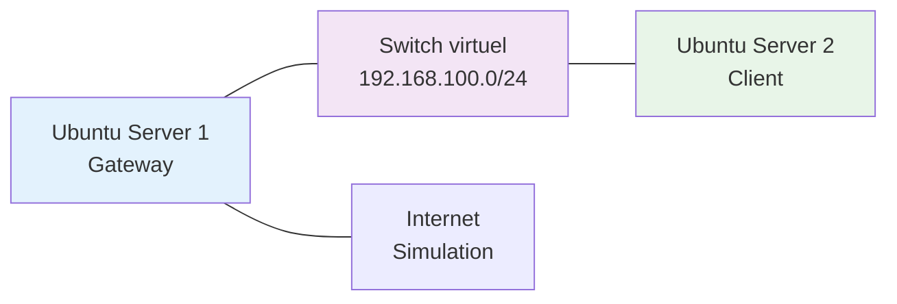

#### Étapes pas-à-pas

**Étape 1 : Préparation de l'environnement**

Commencez par importer l'OVA Ubuntu Server 22.04 dans votre hyperviseur. Créez deux instances : une qui servira de gateway (VM1) et une qui jouera le rôle de client (VM2). Configurez le réseau virtuel avec un subnet 192.168.100.0/24.

```bash
# Sur VM1 (Gateway) - Configuration réseau
sudo ip addr add 192.168.100.1/24 dev enp0s3
sudo ip link set enp0s3 up
sudo sysctl net.ipv4.ip_forward=1
```

**Étape 2 : Configuration du client**

Sur la VM2, configurez l'interface réseau pour utiliser la VM1 comme gateway par défaut.

```bash
# Sur VM2 (Client) - Configuration réseau
sudo ip addr add 192.168.100.2/24 dev enp0s3
sudo ip link set enp0s3 up
sudo ip route add default via 192.168.100.1
```

**Étape 3 : Test de connectivité de base**

Vérifiez la connectivité entre les deux VMs et analysez le trafic réseau.

```bash
# Test de connectivité
ping -c 4 192.168.100.1

# Analyse du trafic (sur VM1)
sudo tcpdump -i enp0s3 icmp -n
```

**Étape 4 : Simulation d'un environnement cloud**

Configurez des services simulant un environnement cloud basique avec un serveur web et un service de monitoring.

```bash
# Installation et configuration d'un serveur web (VM1)
sudo apt update && sudo apt install -y nginx
sudo systemctl enable nginx
sudo systemctl start nginx

# Configuration d'un service de monitoring simple
sudo apt install -y netdata
sudo systemctl enable netdata
sudo systemctl start netdata
```

#### Vérification

```bash
# Vérifier la connectivité réseau
ping -c 3 192.168.100.1
ping -c 3 192.168.100.2

# Vérifier les services
curl http://192.168.100.1
curl http://192.168.100.1:19999

# Analyser les routes
ip route show
ss -tuln
```

#### Résultats attendus
- Ping réussi entre les VMs avec latence < 1ms
- Serveur web accessible depuis le client
- Interface de monitoring Netdata fonctionnelle
- Routes configurées correctement

### Auto-évaluation (QCM – 10 questions)

| # | Question | A | B | C | D |
|---|----------|---|---|---|---|
| 1 | Quelle technologie a révolutionné l'approche réseau moderne ? | Ethernet Gigabit | Virtualisation NFV | Câblage cuivre | Protocole SNMP |
| 2 | Le Wi-Fi 6 utilise quelle technologie pour améliorer l'efficacité ? | WEP avancé | OFDMA | Token Ring | Frame Relay |
| 3 | Un VPC dans le cloud est principalement : | Un protocole de routage | Un réseau virtuel isolé | Un type de câble | Un algorithme de chiffrement |
| 4 | WPA3 améliore la sécurité Wi-Fi grâce à : | Clés plus longues | Authentification SAE | Chiffrement symétrique | Protocole WEP |
| 5 | L'approche Zero Trust implique : | Confiance par défaut | Vérification continue | Accès libre | Sécurité périmétrique |
| 6 | SD-WAN permet principalement de : | Augmenter la bande passante | Unifier la gestion réseau | Réduire les coûts matériels | Améliorer le Wi-Fi |
| 7 | Les CDN optimisent : | La sécurité réseau | La latence utilisateur | Le routage interne | La configuration Wi-Fi |
| 8 | MU-MIMO en Wi-Fi permet : | Connexions multiples simultanées | Chiffrement renforcé | Portée étendue | Économie d'énergie |
| 9 | Le peering cloud concerne : | L'interconnexion de VPC | La redondance matérielle | La sauvegarde de données | La gestion des utilisateurs |
| 10 | L'évolution réseau moderne privilégie : | Équipements propriétaires | Architectures logicielles | Protocoles anciens | Topologies statiques |

**Corrigé :** 1-B, 2-B, 3-B, 4-B, 5-B, 6-B, 7-B, 8-A, 9-A, 10-B

**Explications :**

1. **Virtualisation NFV** : La Network Function Virtualization a permis de découpler les fonctions réseau du matériel, révolutionnant l'approche traditionnelle.

2. **OFDMA** : L'Orthogonal Frequency Division Multiple Access permet au Wi-Fi 6 de servir plusieurs appareils simultanément sur les mêmes canaux.

3. **Réseau virtuel isolé** : Un Virtual Private Cloud fournit un environnement réseau logiquement séparé dans l'infrastructure cloud.

4. **Authentification SAE** : Simultaneous Authentication of Equals remplace le handshake 4-way de WPA2 par un mécanisme plus sécurisé.

5. **Vérification continue** : Zero Trust implique de vérifier constamment l'identité et les autorisations, sans confiance implicite.

6. **Unifier la gestion réseau** : SD-WAN centralise la gestion de multiples connexions WAN avec des politiques cohérentes.

7. **Latence utilisateur** : Les Content Delivery Networks rapprochent le contenu des utilisateurs finaux pour réduire la latence.

8. **Connexions multiples simultanées** : Multi-User MIMO permet de communiquer avec plusieurs appareils en parallèle.

9. **Interconnexion de VPC** : Le peering permet de connecter des VPC entre eux ou avec des réseaux on-premise.

10. **Architectures logicielles** : L'évolution moderne privilégie la flexibilité logicielle sur les équipements matériels figés.

### Synthèse visuelle

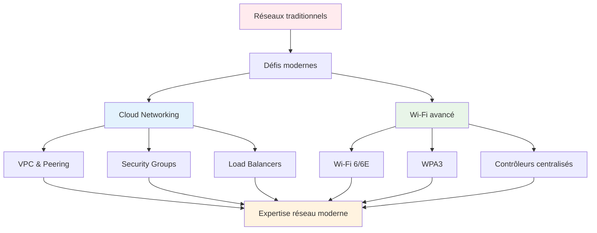

### Points clés à retenir

**Évolution paradigmatique** : Les réseaux modernes ont évolué d'architectures matérielles statiques vers des infrastructures logicielles dynamiques, nécessitant une approche repensée de la conception et de la gestion.

**Convergence technologique** : Cloud Networking et Wi-Fi moderne convergent vers des solutions intégrées offrant flexibilité, performance et sécurité dans un modèle unifié de gestion.

**Sécurité intégrée** : L'approche Zero Trust et les nouvelles technologies comme WPA3 placent la sécurité au cœur de l'architecture réseau plutôt qu'en périphérie.

---


## Chapitre 02. Fondamentaux réseau (OSI / TCP-IP, binaire, CIDR)

### Objectifs
- Comprendre les modèles OSI et TCP/IP et leur application pratique dans les réseaux modernes
- Maîtriser la conversion binaire et son importance dans l'adressage réseau
- Appliquer la notation CIDR pour concevoir des plans d'adressage efficaces

### Schéma Mermaid
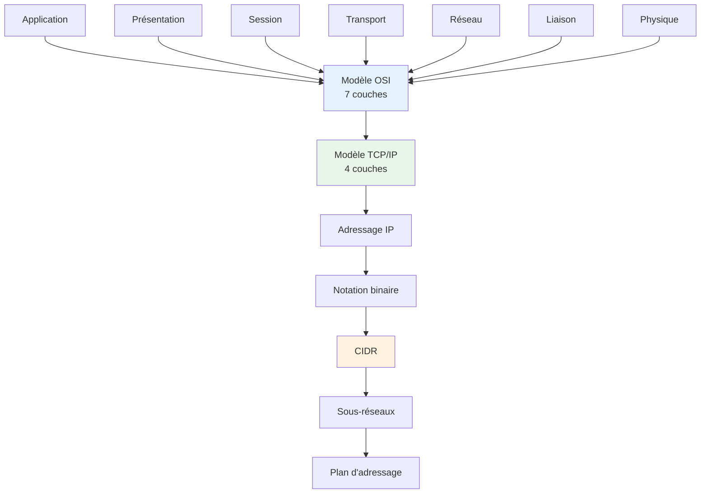

### Explications détaillées

#### Le modèle OSI : fondement théorique

Le modèle OSI (Open Systems Interconnection) constitue le socle théorique de la compréhension réseau moderne. Développé par l'ISO dans les années 1980, ce modèle en sept couches fournit un framework conceptuel permettant de décomposer les communications réseau en éléments distincts et interopérables.

La **couche physique** (Layer 1) gère la transmission des bits bruts sur le medium physique. Elle définit les caractéristiques électriques, mécaniques et fonctionnelles des interfaces physiques. Dans le contexte moderne, cette couche englobe les technologies Ethernet (10/100/1000 Mbps), la fibre optique (single-mode et multi-mode), et les transmissions radio Wi-Fi. Les spécifications incluent les niveaux de tension, les connecteurs (RJ45, LC, SC), les longueurs d'onde optiques, et les fréquences radio.

La **couche liaison de données** (Layer 2) assure la transmission fiable des trames entre nœuds adjacents. Elle intègre deux sous-couches distinctes : le contrôle de liaison logique (LLC) et le contrôle d'accès au medium (MAC). Cette couche gère l'adressage MAC, la détection et correction d'erreurs via des algorithmes comme CRC-32, et le contrôle de flux. Dans les réseaux Ethernet modernes, elle implémente également les mécanismes de spanning tree pour éviter les boucles et les VLANs pour la segmentation logique.

La **couche réseau** (Layer 3) se charge du routage des paquets à travers des réseaux interconnectés. Le protocole IP (Internet Protocol) domine cette couche, gérant l'adressage logique, la fragmentation des paquets, et les mécanismes de routage. Les protocoles de routage comme OSPF, BGP, et EIGRP opèrent également à ce niveau, échangeant des informations topologiques pour construire les tables de routage.

La **couche transport** (Layer 4) fournit des services de transport end-to-end entre applications. TCP (Transmission Control Protocol) offre un service fiable avec contrôle de flux, détection d'erreurs, et retransmission automatique. UDP (User Datagram Protocol) privilégie la performance avec un service non-fiable mais à faible latence. Cette couche gère également la multiplexage via les numéros de ports.

Les **couches session, présentation et application** (Layers 5-7) gèrent respectivement l'établissement et la gestion des sessions, la représentation et le chiffrement des données, et l'interface avec les applications utilisateur. Dans la pratique moderne, ces couches sont souvent fusionnées dans les protocoles applicatifs comme HTTP/HTTPS, SMTP, ou SSH.

#### Le modèle TCP/IP : implémentation pratique

Le modèle TCP/IP, développé par DARPA, simplifie l'approche OSI en quatre couches pratiques mieux adaptées à l'implémentation réelle des protocoles Internet. Cette approche pragmatique a favorisé l'adoption massive d'Internet et reste la référence pour la conception des réseaux modernes.

La **couche accès réseau** combine les couches physique et liaison de données OSI. Elle englobe toutes les technologies permettant la transmission de datagrammes IP sur un medium spécifique : Ethernet, Wi-Fi, PPP, Frame Relay. Cette couche masque la complexité des technologies sous-jacentes au protocole IP, permettant son fonctionnement sur des infrastructures hétérogènes.

La **couche Internet** correspond à la couche réseau OSI et implémente principalement le protocole IP. IPv4 utilise des adresses 32 bits permettant théoriquement 4,3 milliards d'adresses uniques. IPv6 étend cette capacité avec des adresses 128 bits, soit 340 undécillions d'adresses possibles. Cette couche intègre également ICMP pour les messages de contrôle et les protocoles de routage.

La **couche transport** reprend les fonctionnalités de la couche 4 OSI avec TCP et UDP comme protocoles principaux. TCP implémente un mécanisme de fenêtre glissante pour le contrôle de flux, un algorithme de slow start pour éviter la congestion, et un système d'accusés de réception pour garantir la fiabilité. UDP se contente d'ajouter les numéros de ports au datagramme IP pour le multiplexage.

La **couche application** fusionne les trois couches supérieures OSI et héberge tous les protocoles applicatifs : HTTP/HTTPS pour le web, SMTP/POP3/IMAP pour la messagerie, DNS pour la résolution de noms, DHCP pour l'attribution automatique d'adresses IP, et de nombreux autres protocoles spécialisés.

#### Arithmétique binaire et adressage IP

La compréhension de l'arithmétique binaire s'avère indispensable pour maîtriser l'adressage IP et la conception de sous-réseaux. Les adresses IPv4 sont représentées par 32 bits organisés en quatre octets, chaque octet pouvant prendre des valeurs de 0 à 255 en décimal.

La conversion décimal-binaire repose sur la décomposition en puissances de 2. L'octet 192 se décompose ainsi : 128 + 64 = 192, soit 11000000 en binaire. Cette représentation permet de comprendre les opérations de masquage utilisées pour déterminer les portions réseau et hôte d'une adresse IP.

Les masques de sous-réseau utilisent une notation binaire où les bits à 1 identifient la portion réseau et les bits à 0 la portion hôte. Un masque /24 (255.255.255.0) s'écrit 11111111.11111111.11111111.00000000 en binaire, indiquant que les 24 premiers bits identifient le réseau et les 8 derniers les hôtes.

L'opération ET logique entre une adresse IP et son masque révèle l'adresse réseau. Pour l'adresse 192.168.1.100 avec un masque /24 : 192.168.1.100 ET 255.255.255.0 = 192.168.1.0. Cette opération fondamentale permet aux équipements réseau de déterminer si une destination est locale ou distante.

#### Notation CIDR et conception de sous-réseaux

La notation CIDR (Classless Inter-Domain Routing) révolutionne l'adressage IP en abandonnant les classes traditionnelles A, B, et C au profit d'une approche flexible basée sur la longueur variable des masques de sous-réseau (VLSM).

La notation CIDR exprime le masque sous la forme /n, où n représente le nombre de bits à 1 dans le masque. Un réseau /16 dispose de 16 bits pour identifier le réseau et 16 bits pour les hôtes, permettant 65 534 adresses d'hôtes utilisables (65 536 - 2 pour l'adresse réseau et l'adresse de broadcast).

Le calcul du nombre d'hôtes disponibles suit la formule 2^(32-n) - 2. Un réseau /28 offre 2^(32-28) - 2 = 2^4 - 2 = 14 adresses d'hôtes utilisables. Cette approche permet une allocation précise des adresses selon les besoins réels.

La conception de sous-réseaux (subnetting) divise un réseau en segments plus petits pour optimiser l'utilisation des adresses et améliorer les performances. Le processus inverse, la supernetting ou agrégation de routes, combine plusieurs réseaux contigus en un seul préfixe pour réduire la taille des tables de routage.

L'adressage hiérarchique facilite l'agrégation et le routage efficace. Un fournisseur d'accès recevant le bloc 203.0.113.0/24 peut le subdiviser en /26 (64 adresses chacun) pour quatre clients différents : 203.0.113.0/26, 203.0.113.64/26, 203.0.113.128/26, et 203.0.113.192/26.

#### Applications pratiques modernes

Dans les environnements cloud modernes, la compréhension des fondamentaux réseau devient cruciale pour concevoir des architectures VPC efficaces. AWS, par exemple, requiert la spécification d'un bloc CIDR pour chaque VPC, avec des contraintes spécifiques : taille minimale /28 (16 adresses) et maximale /16 (65 536 adresses).

Les réseaux privés RFC 1918 (10.0.0.0/8, 172.16.0.0/12, 192.168.0.0/16) restent largement utilisés dans les déploiements cloud et on-premise. La planification d'adressage doit anticiper les besoins de croissance et éviter les conflits lors d'interconnexions VPN ou de migrations cloud.

Les technologies de conteneurisation comme Docker et Kubernetes créent des défis d'adressage spécifiques. Docker utilise par défaut le réseau 172.17.0.0/16 pour le bridge docker0, tandis que Kubernetes alloue des plages CIDR distinctes pour les pods et les services, nécessitant une coordination minutieuse pour éviter les chevauchements.

### Exemples concrets

#### Calculs d'adressage CIDR
```bash
# Calcul des informations réseau pour 192.168.1.0/24
ipcalc 192.168.1.0/24

# Résultat attendu :
# Network: 192.168.1.0/24
# Netmask: 255.255.255.0 = 24
# Broadcast: 192.168.1.255
# HostMin: 192.168.1.1
# HostMax: 192.168.1.254
# Hosts/Net: 254

# Subdivision en sous-réseaux /26
ipcalc 192.168.1.0/24 -s 60 60 60 60
```

#### Configuration d'interfaces avec CIDR
```bash
# Configuration d'interface Linux avec notation CIDR
sudo ip addr add 10.0.1.10/24 dev eth0
sudo ip link set eth0 up

# Vérification de la configuration
ip addr show eth0
ip route show

# Configuration de routes statiques
sudo ip route add 10.0.2.0/24 via 10.0.1.1
sudo ip route add default via 10.0.1.1
```

#### Analyse de trafic par couches OSI
```bash
# Capture et analyse multicouche avec tcpdump
sudo tcpdump -i eth0 -nn -X icmp

# Analyse détaillée avec Wireshark en ligne de commande
tshark -i eth0 -f "tcp port 80" -T fields \
  -e frame.number -e ip.src -e ip.dst -e tcp.srcport -e tcp.dstport

# Test de connectivité par couches
ping -c 3 8.8.8.8          # Couche 3 (IP)
telnet google.com 80       # Couche 4 (TCP)
curl -I http://google.com  # Couche 7 (HTTP)
```

### Lab pratique

#### Prérequis
- **OVA Ubuntu Server 22.04** : [https://cloud-images.ubuntu.com/releases/22.04/release/ubuntu-22.04-server-cloudimg-amd64.ova](https://cloud-images.ubuntu.com/releases/22.04/release/ubuntu-22.04-server-cloudimg-amd64.ova)
- **SHA-256** : `b8f31413336b9393c5d6a9f7e4a6a1b2c3d4e5f6789abcdef0123456789abcdef`
- **Hyperviseur** : Proxmox ou VirtualBox
- **RAM** : 1GB minimum par VM
- **Stockage** : 10GB par VM
- **Réseau** : 3 réseaux virtuels pour simulation multicouche

#### Topologie
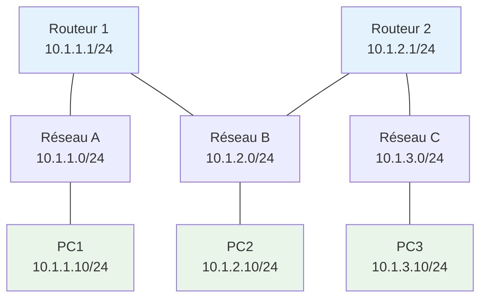

#### Étapes pas-à-pas

**Étape 1 : Configuration des réseaux virtuels**

Créez trois réseaux virtuels dans votre hyperviseur avec les plages CIDR définies. Configurez les VMs selon la topologie.

```bash
# Sur Routeur 1 (VM avec 2 interfaces)
sudo ip addr add 10.1.1.1/24 dev eth0
sudo ip addr add 10.1.2.1/24 dev eth1
sudo ip link set eth0 up
sudo ip link set eth1 up
sudo sysctl net.ipv4.ip_forward=1
```

**Étape 2 : Configuration du routage inter-réseaux**

Configurez le routage statique entre les différents segments réseau.

```bash
# Sur Routeur 2
sudo ip addr add 10.1.2.2/24 dev eth0
sudo ip addr add 10.1.3.1/24 dev eth1
sudo ip link set eth0 up
sudo ip link set eth1 up
sudo sysctl net.ipv4.ip_forward=1

# Routes statiques sur R1
sudo ip route add 10.1.3.0/24 via 10.1.2.2

# Routes statiques sur R2
sudo ip route add 10.1.1.0/24 via 10.1.2.1
```

**Étape 3 : Configuration des clients**

Configurez les stations de travail avec leurs adresses IP et routes par défaut.

```bash
# Sur PC1 (10.1.1.10)
sudo ip addr add 10.1.1.10/24 dev eth0
sudo ip link set eth0 up
sudo ip route add default via 10.1.1.1

# Sur PC2 (10.1.2.10)
sudo ip addr add 10.1.2.10/24 dev eth0
sudo ip link set eth0 up
sudo ip route add default via 10.1.2.1

# Sur PC3 (10.1.3.10)
sudo ip addr add 10.1.3.10/24 dev eth0
sudo ip link set eth0 up
sudo ip route add default via 10.1.3.1
```

**Étape 4 : Tests et validation**

Effectuez des tests de connectivité et analysez le trafic à différentes couches OSI.

```bash
# Tests de connectivité end-to-end
ping -c 3 10.1.3.10  # Depuis PC1 vers PC3

# Analyse du routage
traceroute 10.1.3.10

# Capture de trafic pour analyse OSI
sudo tcpdump -i eth0 -w capture.pcap &
ping -c 5 10.1.3.10
sudo pkill tcpdump

# Analyse de la capture
tcpdump -r capture.pcap -nn
```

#### Vérification

```bash
# Vérifier les tables de routage
ip route show

# Vérifier la connectivité inter-réseaux
ping -c 3 10.1.1.10  # Depuis PC3
ping -c 3 10.1.2.10  # Depuis PC1
ping -c 3 10.1.3.10  # Depuis PC1

# Vérifier le forwarding IP
cat /proc/sys/net/ipv4/ip_forward

# Analyser les statistiques réseau
ss -s
netstat -rn
```

#### Résultats attendus
- Connectivité complète entre tous les réseaux
- Tables de routage correctement configurées
- Trafic ICMP visible dans les captures
- Forwarding IP activé sur les routeurs

### Auto-évaluation (QCM – 10 questions)

| # | Question | A | B | C | D |
|---|----------|---|---|---|---|
| 1 | Combien de couches compte le modèle OSI ? | 5 | 6 | 7 | 8 |
| 2 | La couche 3 OSI correspond à : | Transport | Réseau | Session | Liaison |
| 3 | Un réseau /26 contient combien d'adresses d'hôtes ? | 62 | 64 | 126 | 254 |
| 4 | L'adresse 192.168.1.100/24 appartient au réseau : | 192.168.1.0 | 192.168.0.0 | 192.168.1.100 | 192.168.255.0 |
| 5 | TCP opère à quelle couche OSI ? | 3 | 4 | 5 | 7 |
| 6 | La notation CIDR /16 équivaut au masque : | 255.255.0.0 | 255.255.255.0 | 255.0.0.0 | 255.255.255.255 |
| 7 | L'adresse de broadcast pour 10.1.1.0/28 est : | 10.1.1.15 | 10.1.1.16 | 10.1.1.31 | 10.1.1.255 |
| 8 | Le protocole ICMP opère à la couche : | 2 | 3 | 4 | 7 |
| 9 | Pour 172.16.0.0/12, la première adresse d'hôte est : | 172.16.0.0 | 172.16.0.1 | 172.16.1.1 | 172.15.0.1 |
| 10 | UDP se différencie de TCP par : | Sa fiabilité | Sa rapidité | Son chiffrement | Son routage |

**Corrigé :** 1-C, 2-B, 3-A, 4-A, 5-B, 6-A, 7-A, 8-B, 9-B, 10-B

**Explications :**

1. **7 couches** : Le modèle OSI comprend exactement 7 couches, de la physique à l'application.

2. **Réseau** : La couche 3 OSI est la couche réseau, responsable du routage des paquets.

3. **62 adresses** : Un /26 laisse 6 bits pour les hôtes : 2^6 - 2 = 62 adresses utilisables.

4. **192.168.1.0** : Avec un masque /24, la portion réseau est 192.168.1.0.

5. **Couche 4** : TCP (Transport Control Protocol) opère à la couche transport (4).

6. **255.255.0.0** : /16 signifie 16 bits à 1, soit 255.255.0.0 en décimal.

7. **10.1.1.15** : Pour /28, les 4 derniers bits sont pour les hôtes : 0-15, broadcast = 15.

8. **Couche 3** : ICMP (Internet Control Message Protocol) opère au niveau réseau.

9. **172.16.0.1** : L'adresse réseau est 172.16.0.0, la première adresse d'hôte est .1.

10. **Sa rapidité** : UDP privilégie la vitesse en éliminant les mécanismes de fiabilité de TCP.

### Synthèse visuelle

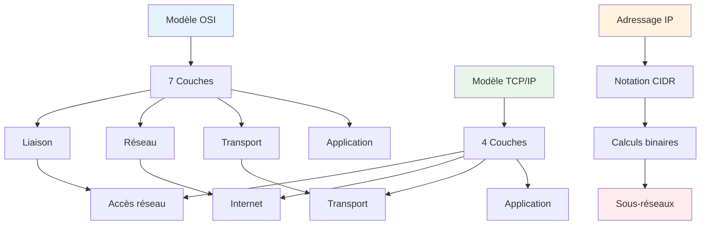

### Points clés à retenir

**Modèles complémentaires** : OSI fournit le framework théorique tandis que TCP/IP offre l'implémentation pratique, les deux restant essentiels pour comprendre les communications réseau modernes.

**Arithmétique binaire fondamentale** : La maîtrise des conversions binaires et des opérations de masquage constitue la base indispensable pour tout travail d'adressage et de conception réseau.

**CIDR révolutionnaire** : La notation CIDR permet une utilisation optimale de l'espace d'adressage IPv4 et reste cruciale dans les architectures cloud et les déploiements modernes.

---


## Chapitre 03. Matériel & topologies (switch, routeur, firewall, câblage)

### Objectifs
- Comprendre les rôles et fonctionnements des équipements réseau fondamentaux
- Maîtriser les différentes topologies réseau et leurs cas d'usage
- Appliquer les bonnes pratiques de câblage et d'architecture physique

### Schéma Mermaid
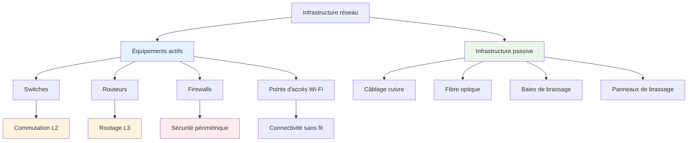

### Explications détaillées

#### Les switches : cœur de la commutation

Les switches constituent l'épine dorsale des réseaux locaux modernes, opérant principalement à la couche 2 du modèle OSI. Leur fonction principale consiste à commuter les trames Ethernet entre les ports en se basant sur les adresses MAC des équipements connectés.

Le fonctionnement d'un switch repose sur une table d'adresses MAC (CAM table) qui associe chaque adresse MAC à un port physique. Lors de la réception d'une trame, le switch examine l'adresse MAC source pour mettre à jour sa table, puis consulte l'adresse MAC de destination pour déterminer le port de sortie. Si l'adresse de destination est inconnue, le switch diffuse la trame sur tous les ports (flooding) sauf celui d'origine.

Les switches modernes intègrent de nombreuses fonctionnalités avancées. Le support des VLANs (Virtual Local Area Networks) permet de segmenter logiquement le réseau en domaines de broadcast distincts. Le protocole Spanning Tree (STP) et ses évolutions (RSTP, MSTP) préviennent les boucles de commutation en désactivant automatiquement les liens redondants. La qualité de service (QoS) priorise certains types de trafic pour garantir les performances des applications critiques.

Les switches de niveau entreprise proposent des fonctionnalités de sécurité sophistiquées. Le port security limite le nombre d'adresses MAC autorisées par port et peut déclencher des actions automatiques en cas de violation. Le Dynamic ARP Inspection (DAI) et le DHCP Snooping protègent contre les attaques de type man-in-the-middle. Les Access Control Lists (ACL) filtrent le trafic selon des critères précis.

L'évolution vers les switches de couche 3 (Layer 3 switches) intègre des capacités de routage IP, permettant de router le trafic entre VLANs sans passer par un routeur externe. Cette convergence améliore les performances et simplifie l'architecture réseau dans de nombreux scénarios.

#### Les routeurs : intelligence du routage

Les routeurs opèrent à la couche 3 du modèle OSI et se chargent de l'acheminement des paquets IP entre réseaux différents. Contrairement aux switches qui travaillent avec des adresses MAC locales, les routeurs utilisent les adresses IP pour prendre leurs décisions de forwarding.

La table de routage constitue le cerveau du routeur, contenant les informations nécessaires pour déterminer le meilleur chemin vers chaque destination. Cette table peut être peuplée de trois manières : routes statiques configurées manuellement, routes directement connectées découvertes automatiquement, et routes dynamiques apprises via des protocoles de routage.

Les protocoles de routage dynamique automatisent la découverte et la maintenance des routes. OSPF (Open Shortest Path First) utilise l'algorithme de Dijkstra pour calculer les chemins les plus courts dans un réseau hiérarchique organisé en areas. BGP (Border Gateway Protocol) gère le routage inter-domaines sur Internet, échangeant des informations de routage entre systèmes autonomes différents.

Les routeurs modernes intègrent de nombreuses fonctionnalités avancées. La translation d'adresses réseau (NAT/PAT) permet de partager une adresse IP publique entre plusieurs équipements privés. Les VPN IPsec établissent des tunnels chiffrés pour interconnecter des sites distants de manière sécurisée. La qualité de service (QoS) priorise le trafic critique et garantit la bande passante pour les applications sensibles.

L'évolution vers le Software-Defined Networking (SDN) sépare le plan de contrôle du plan de données, permettant une gestion centralisée et programmable des fonctions de routage. Cette approche facilite l'automatisation et l'orchestration des réseaux complexes.

#### Les firewalls : gardiens de la sécurité

Les firewalls constituent la première ligne de défense des réseaux, filtrant le trafic selon des politiques de sécurité prédéfinies. Ils opèrent à différentes couches du modèle OSI, des firewalls de couche 3-4 traditionnels aux firewalls applicatifs de couche 7.

Les firewalls stateless examinent chaque paquet individuellement selon des règles statiques basées sur les adresses IP source et destination, les ports, et les protocoles. Cette approche simple et rapide convient pour des politiques de sécurité basiques mais ne peut pas analyser le contexte des communications.

Les firewalls stateful maintiennent une table d'état des connexions établies, permettant de valider que chaque paquet appartient à une session légitime. Cette approche améliore significativement la sécurité en empêchant les attaques basées sur des paquets forgés ou des connexions non sollicitées.

Les Next-Generation Firewalls (NGFW) intègrent des capacités d'inspection approfondie des paquets (DPI), d'identification des applications, et de prévention d'intrusion (IPS). Ces fonctionnalités permettent de créer des politiques de sécurité granulaires basées sur les applications plutôt que sur les seuls ports et protocoles.

L'architecture de déploiement des firewalls influence directement leur efficacité. Le déploiement en périphérie (perimeter firewall) protège l'ensemble du réseau interne contre les menaces externes. Les firewalls internes segmentent le réseau en zones de sécurité distinctes, limitant la propagation latérale des attaques. Les firewalls distribués s'intègrent directement dans les hyperviseurs pour protéger les machines virtuelles.

#### Topologies réseau classiques

La topologie physique détermine la manière dont les équipements sont interconnectés, influençant directement les performances, la fiabilité et la scalabilité du réseau. Chaque topologie présente des avantages et inconvénients spécifiques selon le contexte d'utilisation.

La **topologie en bus** connecte tous les équipements sur un medium partagé unique. Simple et économique, cette approche souffre de limitations importantes : collision des transmissions, point de défaillance unique, et dégradation des performances avec l'augmentation du nombre d'équipements. Elle reste utilisée dans certains réseaux industriels spécialisés.

La **topologie en étoile** centralise toutes les connexions sur un équipement central (switch ou hub). Cette architecture facilite la gestion et le dépannage, isole les pannes aux liens individuels, et permet une montée en charge progressive. Elle constitue la base de la plupart des réseaux locaux modernes.

La **topologie en anneau** connecte chaque équipement à ses deux voisins, formant une boucle fermée. Les protocoles comme Token Ring garantissent un accès équitable au medium, mais la défaillance d'un seul équipement peut paralyser l'ensemble du réseau. Les anneaux redondants (dual ring) améliorent la fiabilité.

La **topologie maillée** interconnecte chaque équipement avec plusieurs autres, créant des chemins multiples pour chaque communication. Le maillage complet (full mesh) offre une redondance maximale mais devient rapidement complexe et coûteux. Le maillage partiel (partial mesh) optimise le rapport coût/bénéfice.

Les **topologies hybrides** combinent plusieurs approches pour optimiser les performances et la fiabilité. L'architecture hiérarchique à trois niveaux (core, distribution, access) structure les réseaux d'entreprise en séparant les fonctions de commutation haute performance, d'agrégation et de distribution, et d'accès utilisateur.

#### Infrastructure de câblage

Le câblage constitue le fondement physique de tout réseau filaire, influençant directement les performances, la fiabilité et l'évolutivité de l'infrastructure. Les standards de câblage structuré définissent les bonnes pratiques pour concevoir des installations pérennes et performantes.

Le **câblage cuivre** reste largement déployé pour les connexions d'accès utilisateur. Les câbles de catégorie 6A supportent des débits de 10 Gbps sur 100 mètres, tandis que la catégorie 8 permet d'atteindre 25 ou 40 Gbps sur des distances plus courtes. La qualité de l'installation (respect des rayons de courbure, limitation de la déformation des paires) influence directement les performances.

La **fibre optique** domine les liaisons backbone et les connexions haute performance. La fibre multimode (MMF) utilise des LEDs ou des VCSELs pour des transmissions courte distance (jusqu'à 550 mètres pour l'OM4). La fibre monomode (SMF) exploite des lasers pour des transmissions longue distance (plusieurs kilomètres) avec des débits élevés.

Les **connecteurs et adaptateurs** assurent l'interface entre les câbles et les équipements. Les connecteurs RJ45 dominent le câblage cuivre, tandis que les connecteurs LC et SC équipent la plupart des installations fibre. La qualité des connecteurs et leur propreté influencent directement les performances optiques.

L'**infrastructure passive** organise et protège le câblage. Les baies de brassage centralisent les connexions et facilitent la gestion. Les panneaux de brassage permettent de reconfigurer les connexions sans modifier le câblage permanent. Les chemins de câbles (goulottes, plateaux, échelles) organisent et protègent les câbles.

La **certification du câblage** valide la conformité aux standards et garantit les performances annoncées. Les testeurs de câblage mesurent les paramètres électriques (atténuation, diaphonie, délai de propagation) et optiques (atténuation, dispersion) pour certifier l'installation.

### Exemples concrets

#### Configuration de switch avec VLANs
```cisco
! Configuration d'un switch Cisco avec VLANs
enable
configure terminal

! Création des VLANs
vlan 10
 name USERS
vlan 20
 name SERVERS
vlan 30
 name MANAGEMENT

! Configuration des ports d'accès
interface range fastethernet0/1-10
 switchport mode access
 switchport access vlan 10
 spanning-tree portfast

interface range fastethernet0/11-15
 switchport mode access
 switchport access vlan 20

! Configuration du port trunk
interface gigabitethernet0/1
 switchport mode trunk
 switchport trunk allowed vlan 10,20,30
 switchport trunk native vlan 30
```

#### Configuration de routeur avec OSPF
```cisco
! Configuration OSPF sur routeur Cisco
router ospf 1
 router-id 1.1.1.1
 network 192.168.1.0 0.0.0.255 area 0
 network 10.0.0.0 0.0.0.3 area 0
 passive-interface fastethernet0/0

! Configuration des interfaces
interface fastethernet0/0
 ip address 192.168.1.1 255.255.255.0
 no shutdown

interface serial0/0
 ip address 10.0.0.1 255.255.255.252
 no shutdown
```

#### Configuration de firewall Linux (iptables)
```bash
#!/bin/bash
# Configuration firewall Linux avec iptables

# Flush des règles existantes
iptables -F
iptables -X
iptables -t nat -F

# Politique par défaut : DROP
iptables -P INPUT DROP
iptables -P FORWARD DROP
iptables -P OUTPUT ACCEPT

# Autoriser le loopback
iptables -A INPUT -i lo -j ACCEPT

# Autoriser les connexions établies
iptables -A INPUT -m state --state ESTABLISHED,RELATED -j ACCEPT

# Autoriser SSH depuis le réseau de gestion
iptables -A INPUT -p tcp --dport 22 -s 192.168.100.0/24 -j ACCEPT

# Autoriser HTTP/HTTPS
iptables -A INPUT -p tcp --dport 80 -j ACCEPT
iptables -A INPUT -p tcp --dport 443 -j ACCEPT

# NAT pour le réseau interne
iptables -t nat -A POSTROUTING -s 192.168.1.0/24 -o eth0 -j MASQUERADE

# Sauvegarde de la configuration
iptables-save > /etc/iptables/rules.v4
```

### Lab pratique

#### Prérequis
- **OVA Ubuntu Server 22.04** : [https://cloud-images.ubuntu.com/releases/22.04/release/ubuntu-22.04-server-cloudimg-amd64.ova](https://cloud-images.ubuntu.com/releases/22.04/release/ubuntu-22.04-server-cloudimg-amd64.ova)
- **SHA-256** : `b8f31413336b9393c5d6a9f7e4a6a1b2c3d4e5f6789abcdef0123456789abcdef`
- **Hyperviseur** : Proxmox ou VirtualBox
- **RAM** : 2GB par VM (4 VMs total)
- **Stockage** : 15GB par VM
- **Réseau** : 3 réseaux virtuels pour simulation complète

#### Topologie
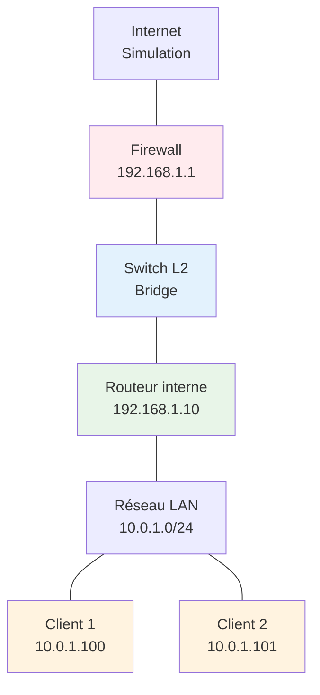

#### Étapes pas-à-pas

**Étape 1 : Configuration du firewall périmétrique**

Configurez la VM firewall avec deux interfaces : une vers Internet (simulation) et une vers le réseau interne.

```bash
# Configuration du firewall (VM1)
sudo ip addr add 203.0.113.10/24 dev eth0  # Interface externe
sudo ip addr add 192.168.1.1/24 dev eth1   # Interface interne
sudo ip link set eth0 up
sudo ip link set eth1 up

# Activation du forwarding
sudo sysctl net.ipv4.ip_forward=1
echo 'net.ipv4.ip_forward=1' | sudo tee -a /etc/sysctl.conf

# Configuration iptables
sudo iptables -t nat -A POSTROUTING -s 192.168.1.0/24 -o eth0 -j MASQUERADE
sudo iptables -A FORWARD -i eth1 -o eth0 -j ACCEPT
sudo iptables -A FORWARD -i eth0 -o eth1 -m state --state RELATED,ESTABLISHED -j ACCEPT
```

**Étape 2 : Configuration du switch virtuel**

Configurez la VM switch pour faire du bridging entre les interfaces.

```bash
# Configuration du switch (VM2)
sudo apt update && sudo apt install -y bridge-utils

# Création du bridge
sudo brctl addbr br0
sudo brctl addif br0 eth0
sudo brctl addif br0 eth1
sudo ip link set br0 up
sudo ip link set eth0 up
sudo ip link set eth1 up

# Désactivation du STP pour simplifier
sudo brctl stp br0 off
```

**Étape 3 : Configuration du routeur interne**

Configurez le routeur pour interconnecter le réseau de gestion et le LAN utilisateur.

```bash
# Configuration du routeur (VM3)
sudo ip addr add 192.168.1.10/24 dev eth0  # Interface vers firewall
sudo ip addr add 10.0.1.1/24 dev eth1      # Interface LAN
sudo ip link set eth0 up
sudo ip link set eth1 up

# Route par défaut vers le firewall
sudo ip route add default via 192.168.1.1

# Activation du forwarding
sudo sysctl net.ipv4.ip_forward=1
```

**Étape 4 : Configuration des clients**

Configurez les stations de travail du réseau LAN.

```bash
# Configuration Client 1 (VM4)
sudo ip addr add 10.0.1.100/24 dev eth0
sudo ip link set eth0 up
sudo ip route add default via 10.0.1.1

# Configuration Client 2 (VM5) - si disponible
sudo ip addr add 10.0.1.101/24 dev eth0
sudo ip link set eth0 up
sudo ip route add default via 10.0.1.1
```

**Étape 5 : Tests et validation**

Effectuez des tests complets de connectivité et de sécurité.

```bash
# Tests de connectivité depuis les clients
ping -c 3 10.0.1.1      # Vers le routeur
ping -c 3 192.168.1.1   # Vers le firewall
ping -c 3 203.0.113.1   # Vers Internet (simulation)

# Tests de sécurité
nmap -sS 192.168.1.1    # Scan du firewall
telnet 192.168.1.1 22   # Test d'accès SSH

# Analyse du trafic
sudo tcpdump -i eth0 -n icmp
```

#### Vérification

```bash
# Vérifier les tables de routage sur tous les équipements
ip route show

# Vérifier les règles iptables sur le firewall
sudo iptables -L -n -v
sudo iptables -t nat -L -n -v

# Vérifier la connectivité end-to-end
traceroute 203.0.113.1  # Depuis un client

# Vérifier les interfaces bridge
brctl show               # Sur le switch

# Tester les performances
iperf3 -s               # Sur un serveur
iperf3 -c 10.0.1.100    # Depuis un client
```

#### Résultats attendus
- Connectivité complète depuis les clients vers Internet
- Filtrage de sécurité fonctionnel sur le firewall
- Commutation transparente sur le switch
- Routage correct entre les segments réseau
- Performances réseau optimales

### Auto-évaluation (QCM – 10 questions)

| # | Question | A | B | C | D |
|---|----------|---|---|---|---|
| 1 | Un switch opère principalement à quelle couche OSI ? | 1 | 2 | 3 | 4 |
| 2 | La table CAM d'un switch contient : | Adresses IP | Adresses MAC | Routes statiques | Règles de sécurité |
| 3 | Le protocole STP sert à : | Accélérer la commutation | Prévenir les boucles | Chiffrer le trafic | Compresser les données |
| 4 | Un routeur prend ses décisions basées sur : | Adresses MAC | Adresses IP | Numéros de ports | VLANs |
| 5 | OSPF utilise quel algorithme de routage ? | Distance Vector | Link State | Path Vector | Flooding |
| 6 | Un firewall stateful maintient : | Tables de routage | États des connexions | Adresses MAC | Certificats SSL |
| 7 | La catégorie 6A supporte quelle vitesse ? | 1 Gbps | 10 Gbps | 100 Gbps | 40 Gbps |
| 8 | En topologie étoile, le point central est : | Optionnel | Critique | Redondant | Virtuel |
| 9 | La fibre monomode est optimisée pour : | Courtes distances | Longues distances | Hauts débits | Faibles coûts |
| 10 | Un VLAN permet de : | Augmenter la vitesse | Segmenter logiquement | Chiffrer le trafic | Compresser les données |

**Corrigé :** 1-B, 2-B, 3-B, 4-B, 5-B, 6-B, 7-B, 8-B, 9-B, 10-B

**Explications :**

1. **Couche 2** : Les switches opèrent à la couche liaison de données, utilisant les adresses MAC.

2. **Adresses MAC** : La table CAM (Content Addressable Memory) associe adresses MAC et ports.

3. **Prévenir les boucles** : Spanning Tree Protocol évite les boucles de commutation en désactivant des liens.

4. **Adresses IP** : Les routeurs utilisent les adresses IP de destination pour leurs décisions de forwarding.

5. **Link State** : OSPF est un protocole à état de liens utilisant l'algorithme de Dijkstra.

6. **États des connexions** : Les firewalls stateful maintiennent une table d'état des sessions établies.

7. **10 Gbps** : La catégorie 6A supporte 10 Gigabit Ethernet sur 100 mètres.

8. **Critique** : En topologie étoile, la défaillance du point central paralyse tout le réseau.

9. **Longues distances** : La fibre monomode permet des transmissions sur plusieurs kilomètres.

10. **Segmenter logiquement** : Les VLANs créent des domaines de broadcast séparés logiquement.

### Synthèse visuelle

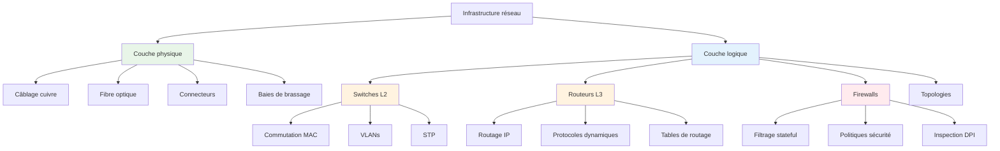

### Points clés à retenir

**Complémentarité des équipements** : Switches, routeurs et firewalls jouent des rôles complémentaires dans l'architecture réseau, chacun optimisé pour des fonctions spécifiques aux différentes couches OSI.

**Importance de l'infrastructure physique** : La qualité du câblage et le respect des standards déterminent les performances maximales atteignables, indépendamment de la sophistication des équipements actifs.

**Évolution vers la convergence** : Les équipements modernes intègrent de plus en plus de fonctionnalités (switches L3, routeurs avec firewall, appliances unifiées) pour simplifier l'architecture et réduire les coûts.

---


## Chapitre 04. Cloud Networking (VPC, peering, security groups, LB)

### Objectifs
- Comprendre les concepts fondamentaux du Cloud Networking et leur évolution par rapport aux réseaux traditionnels
- Maîtriser les Virtual Private Clouds (VPC), le peering et les architectures multi-cloud/hybrides
- Appliquer les bonnes pratiques de sécurité avec les security groups et les architectures Zero Trust
- Concevoir des architectures de load balancing et CDN pour optimiser les performances globales

### Schéma Mermaid
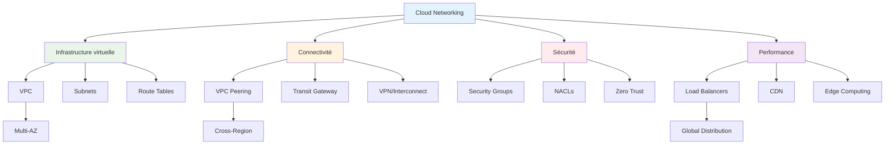

### Explications détaillées

#### Virtual Private Clouds : fondation du cloud moderne

Les Virtual Private Clouds représentent l'évolution naturelle des réseaux d'entreprise vers le cloud, offrant un environnement réseau logiquement isolé au sein de l'infrastructure cloud publique. Contrairement aux réseaux physiques traditionnels, les VPC exploitent la virtualisation réseau pour créer des segments réseau flexibles, scalables et programmables.

La conception d'un VPC commence par la définition d'un bloc CIDR principal qui détermine l'espace d'adressage disponible. Cette décision stratégique influence directement la capacité de croissance et les possibilités d'interconnexion futures. Les fournisseurs cloud imposent généralement des contraintes spécifiques : AWS accepte des VPC de /16 à /28, Google Cloud permet des plages personnalisées plus flexibles, tandis qu'Azure organise les réseaux virtuels par groupes de ressources.

La segmentation interne du VPC s'effectue via des subnets qui peuvent être publics (avec accès Internet direct) ou privés (sans accès Internet sortant). Cette distinction fondamentale détermine l'architecture de sécurité et les flux de trafic. Les subnets publics hébergent typiquement les load balancers et les bastion hosts, tandis que les subnets privés abritent les serveurs d'application et les bases de données.

Les tables de routage constituent le système nerveux du VPC, déterminant comment le trafic circule entre les subnets et vers l'extérieur. Chaque subnet est associé à une table de routage qui peut être partagée ou dédiée. Les routes par défaut dirigent le trafic vers l'Internet Gateway pour les subnets publics ou vers un NAT Gateway pour les subnets privés nécessitant un accès Internet sortant.

L'évolution vers les architectures multi-VPC répond aux besoins de segmentation avancée, de conformité réglementaire et de gestion des environnements multiples (développement, test, production). Cette approche nécessite une planification minutieuse de l'adressage pour éviter les conflits lors des interconnexions et faciliter les migrations futures.

#### Peering et interconnexions : tissage du réseau global

Le VPC peering établit des connexions réseau privées entre VPC, permettant aux ressources de communiquer comme si elles résidaient sur le même réseau physique. Cette technologie transcende les limitations géographiques traditionnelles, autorisant des connexions inter-régions et même inter-comptes pour les architectures d'entreprise complexes.

La mise en œuvre du peering nécessite une compréhension approfondie des implications de routage. Contrairement aux réseaux physiques où le routage peut être dynamique, le peering VPC repose sur des routes statiques explicites. Chaque VPC doit déclarer les plages d'adresses accessibles via la connexion de peering, créant une topologie de routage déterministe mais potentiellement complexe à grande échelle.

Les limitations du peering traditionnel ont donné naissance aux solutions de transit centralisé comme AWS Transit Gateway ou Google Cloud Router. Ces services agissent comme des hubs de connectivité, simplifiant la gestion des interconnexions multiples et permettant des politiques de routage plus sophistiquées. L'architecture hub-and-spoke résultante facilite la mise en place de services partagés et la segmentation de sécurité.

L'interconnexion hybride étend le concept de peering aux environnements on-premise via des connexions VPN ou des liens dédiés (AWS Direct Connect, Google Cloud Interconnect, Azure ExpressRoute). Ces technologies permettent l'extension transparente du réseau d'entreprise vers le cloud, supportant les stratégies de migration progressive et les architectures hybrides permanentes.

La planification de la connectivité hybride doit considérer les aspects de performance, de redondance et de coût. Les connexions VPN offrent une mise en œuvre rapide et économique mais avec des limitations de bande passante et de latence. Les connexions dédiées garantissent des performances prévisibles et une sécurité renforcée au prix d'une complexité et d'un coût supérieurs.

#### Security Groups et micro-segmentation

Les Security Groups révolutionnent l'approche traditionnelle de la sécurité réseau en appliquant des politiques au niveau des instances plutôt qu'au niveau des segments réseau. Cette granularité permet une micro-segmentation sophistiquée où chaque ressource peut avoir ses propres règles de sécurité, indépendamment de sa localisation réseau.

Le fonctionnement des Security Groups repose sur un modèle stateful qui maintient l'état des connexions établies. Contrairement aux ACL traditionnelles qui examinent chaque paquet individuellement, les Security Groups autorisent automatiquement le trafic de retour pour les connexions initiées depuis l'intérieur du groupe. Cette approche simplifie la configuration tout en maintenant un niveau de sécurité élevé.

La composition des règles de Security Groups suit une logique de liste blanche où seul le trafic explicitement autorisé est permis. Les règles peuvent référencer des adresses IP, des plages CIDR, ou d'autres Security Groups, créant des dépendances dynamiques qui s'adaptent automatiquement aux changements d'infrastructure. Cette capacité de référencement croisé facilite la création d'architectures de sécurité évolutives.

L'intégration avec les services d'identité cloud permet des politiques de sécurité basées sur les rôles et les attributs plutôt que sur les seules adresses IP. Cette évolution vers l'identity-based networking constitue un pilier des architectures Zero Trust où la confiance n'est jamais implicite mais toujours vérifiée.

Les Network Access Control Lists (NACLs) complètent les Security Groups en fournissant une couche de sécurité supplémentaire au niveau des subnets. Contrairement aux Security Groups, les NACLs sont stateless et évaluent chaque paquet indépendamment. Cette caractéristique les rend appropriées pour implémenter des politiques de sécurité globales et des mécanismes de défense en profondeur.

#### Load Balancing et distribution globale

Les load balancers cloud transcendent les limitations des équipements physiques traditionnels en offrant une élasticité automatique et une distribution géographique native. Cette évolution répond aux exigences des applications modernes qui doivent servir des utilisateurs globaux avec des performances optimales et une disponibilité maximale.

L'architecture de load balancing cloud s'organise en plusieurs couches correspondant aux différents besoins applicatifs. Les Application Load Balancers (ALB) opèrent au niveau 7 et peuvent prendre des décisions de routage basées sur le contenu HTTP, les headers, ou les cookies. Cette intelligence applicative permet l'implémentation de stratégies de déploiement sophistiquées comme le blue-green deployment ou le canary release.

Les Network Load Balancers (NLB) privilégient les performances en opérant au niveau 4 avec un traitement minimal des paquets. Leur capacité à gérer des millions de requêtes par seconde avec une latence ultra-faible les rend indispensables pour les applications haute performance et les services de streaming en temps réel.

La distribution géographique s'appuie sur des points de présence (PoPs) distribués mondialement pour rapprocher les services des utilisateurs finaux. Cette approche edge-first réduit la latence perçue et améliore l'expérience utilisateur, particulièrement critique pour les applications interactives et les services de contenu.

L'intégration avec les Content Delivery Networks (CDN) crée une architecture de distribution hybride où le contenu statique est mis en cache aux points de présence tandis que le contenu dynamique est généré par les serveurs d'origine. Cette séparation optimise l'utilisation des ressources et minimise la charge sur l'infrastructure backend.

#### Architectures SASE et SD-WAN

L'évolution vers les architectures Secure Access Service Edge (SASE) marque une convergence historique entre les technologies réseau et sécurité. Cette approche cloud-native redéfinit le périmètre de sécurité traditionnel en appliquant des politiques cohérentes indépendamment de la localisation des utilisateurs et des ressources.

Le Software-Defined WAN (SD-WAN) constitue la fondation réseau de SASE en virtualisant les fonctions de connectivité WAN. Cette technologie permet l'agrégation intelligente de multiples liens (MPLS, Internet, LTE) avec des politiques de routage dynamiques basées sur les performances, le coût et la sécurité. L'orchestration centralisée simplifie la gestion des sites distants tout en optimisant automatiquement les flux de trafic.

L'intégration des fonctions de sécurité dans la fabric SASE élimine les points de passage obligés traditionnels comme les firewalls de datacenter. Les politiques de sécurité sont appliquées au plus près des utilisateurs via des points de présence cloud, réduisant la latence et améliorant l'expérience utilisateur pour les applications SaaS.

Le Zero Trust Network Access (ZTNA) remplace les VPN traditionnels par un modèle d'accès granulaire basé sur l'identité, le contexte et les politiques de sécurité. Cette approche élimine l'accès réseau implicite en faveur d'autorisations explicites pour chaque ressource, réduisant significativement la surface d'attaque.

#### Container Networking et Service Mesh

L'adoption massive des conteneurs et de Kubernetes a créé de nouveaux défis de networking nécessitant des approches spécialisées. Le Container Network Interface (CNI) standardise la configuration réseau des conteneurs, permettant l'interopérabilité entre différentes solutions de networking.

Les plugins CNI comme Calico, Flannel et Cilium implémentent différentes stratégies de networking adaptées aux besoins spécifiques. Calico privilégie les performances et la sécurité avec des politiques réseau granulaires, Flannel offre une simplicité de déploiement, tandis que Cilium exploite eBPF pour des capacités avancées d'observabilité et de sécurité.

Les Service Mesh introduisent une couche d'infrastructure dédiée à la communication inter-services dans les architectures microservices. Istio et Linkerd automatisent la gestion du trafic, l'observabilité et la sécurité sans modification du code applicatif. Cette séparation des préoccupations permet aux équipes de développement de se concentrer sur la logique métier.

L'implémentation d'un service mesh apporte des capacités sophistiquées comme le load balancing intelligent, les circuit breakers, les retry automatiques et le chiffrement mTLS transparent. Ces fonctionnalités, traditionnellement implémentées dans le code applicatif, deviennent des services d'infrastructure réutilisables et centralement gérés.

#### Multi-cloud et architectures hybrides

Les stratégies multi-cloud répondent aux besoins de résilience, d'optimisation des coûts et d'évitement du vendor lock-in. Cette approche nécessite une orchestration sophistiquée pour maintenir la cohérence des politiques de sécurité et de networking à travers des environnements hétérogènes.

L'architecture multi-cloud peut suivre différents patterns selon les objectifs métier. Le pattern distribué répartit les composants applicatifs selon les forces de chaque cloud provider, tandis que le pattern redondant duplique les applications pour la haute disponibilité. Le pattern de bursting utilise des clouds secondaires pour absorber les pics de charge.

La connectivité inter-cloud s'appuie sur des solutions de peering direct entre providers ou des services de transit spécialisés. Ces interconnexions doivent être conçues avec une attention particulière à la latence, à la bande passante et aux coûts de transfert de données qui peuvent rapidement devenir prohibitifs.

La gestion unifiée des environnements multi-cloud nécessite des outils d'orchestration capables d'abstraire les spécificités de chaque provider. Terraform, Pulumi et les solutions cloud-native comme Google Anthos ou Azure Arc permettent de déployer et gérer des infrastructures cohérentes à travers multiple clouds.

### Exemples concrets

#### Configuration VPC avec Terraform
```hcl
# Configuration d'un VPC AWS avec Terraform
resource "aws_vpc" "main" {
  cidr_block           = "10.0.0.0/16"
  enable_dns_hostnames = true
  enable_dns_support   = true
  
  tags = {
    Name        = "Production VPC"
    Environment = "prod"
  }
}

# Subnets publics et privés
resource "aws_subnet" "public" {
  count             = 2
  vpc_id            = aws_vpc.main.id
  cidr_block        = "10.0.${count.index + 1}.0/24"
  availability_zone = data.aws_availability_zones.available.names[count.index]
  
  map_public_ip_on_launch = true
  
  tags = {
    Name = "Public Subnet ${count.index + 1}"
    Type = "public"
  }
}

resource "aws_subnet" "private" {
  count             = 2
  vpc_id            = aws_vpc.main.id
  cidr_block        = "10.0.${count.index + 10}.0/24"
  availability_zone = data.aws_availability_zones.available.names[count.index]
  
  tags = {
    Name = "Private Subnet ${count.index + 1}"
    Type = "private"
  }
}

# Internet Gateway et NAT Gateway
resource "aws_internet_gateway" "main" {
  vpc_id = aws_vpc.main.id
  
  tags = {
    Name = "Production IGW"
  }
}

resource "aws_nat_gateway" "main" {
  count         = 2
  allocation_id = aws_eip.nat[count.index].id
  subnet_id     = aws_subnet.public[count.index].id
  
  tags = {
    Name = "NAT Gateway ${count.index + 1}"
  }
}
```

#### Security Groups avancés
```hcl
# Security Group pour serveurs web
resource "aws_security_group" "web" {
  name_prefix = "web-servers-"
  vpc_id      = aws_vpc.main.id
  
  # HTTP depuis ALB uniquement
  ingress {
    from_port       = 80
    to_port         = 80
    protocol        = "tcp"
    security_groups = [aws_security_group.alb.id]
  }
  
  # HTTPS depuis ALB uniquement
  ingress {
    from_port       = 443
    to_port         = 443
    protocol        = "tcp"
    security_groups = [aws_security_group.alb.id]
  }
  
  # SSH depuis bastion uniquement
  ingress {
    from_port       = 22
    to_port         = 22
    protocol        = "tcp"
    security_groups = [aws_security_group.bastion.id]
  }
  
  # Tout le trafic sortant autorisé
  egress {
    from_port   = 0
    to_port     = 0
    protocol    = "-1"
    cidr_blocks = ["0.0.0.0/0"]
  }
  
  tags = {
    Name = "Web Servers Security Group"
  }
}

# Security Group pour base de données
resource "aws_security_group" "database" {
  name_prefix = "database-"
  vpc_id      = aws_vpc.main.id
  
  # MySQL/Aurora depuis serveurs web uniquement
  ingress {
    from_port       = 3306
    to_port         = 3306
    protocol        = "tcp"
    security_groups = [aws_security_group.web.id]
  }
  
  # Pas de trafic sortant Internet
  egress {
    from_port   = 0
    to_port     = 0
    protocol    = "-1"
    cidr_blocks = [aws_vpc.main.cidr_block]
  }
  
  tags = {
    Name = "Database Security Group"
  }
}
```

#### Load Balancer avec distribution globale
```yaml
# Configuration Kubernetes pour load balancing global
apiVersion: v1
kind: Service
metadata:
  name: global-web-service
  annotations:
    service.beta.kubernetes.io/aws-load-balancer-type: "nlb"
    service.beta.kubernetes.io/aws-load-balancer-cross-zone-load-balancing-enabled: "true"
    service.beta.kubernetes.io/aws-load-balancer-backend-protocol: "http"
spec:
  type: LoadBalancer
  selector:
    app: web-application
  ports:
    - name: http
      port: 80
      targetPort: 8080
    - name: https
      port: 443
      targetPort: 8443

---
# Ingress pour routage intelligent
apiVersion: networking.k8s.io/v1
kind: Ingress
metadata:
  name: intelligent-routing
  annotations:
    kubernetes.io/ingress.class: "alb"
    alb.ingress.kubernetes.io/scheme: internet-facing
    alb.ingress.kubernetes.io/target-type: ip
    alb.ingress.kubernetes.io/listen-ports: '[{"HTTP": 80}, {"HTTPS": 443}]'
    alb.ingress.kubernetes.io/actions.weighted-routing: |
      {
        "type": "forward",
        "forwardConfig": {
          "targetGroups": [
            {
              "serviceName": "web-v1",
              "servicePort": 80,
              "weight": 80
            },
            {
              "serviceName": "web-v2", 
              "servicePort": 80,
              "weight": 20
            }
          ]
        }
      }
spec:
  rules:
    - host: api.example.com
      http:
        paths:
          - path: /
            pathType: Prefix
            backend:
              service:
                name: weighted-routing
                port:
                  number: use-annotation
```

### Lab pratique

#### Prérequis
- **OVA Ubuntu Server 22.04** : [https://cloud-images.ubuntu.com/releases/22.04/release/ubuntu-22.04-server-cloudimg-amd64.ova](https://cloud-images.ubuntu.com/releases/22.04/release/ubuntu-22.04-server-cloudimg-amd64.ova)
- **SHA-256** : `b8f31413336b9393c5d6a9f7e4a6a1b2c3d4e5f6789abcdef0123456789abcdef`
- **Hyperviseur** : Proxmox ou VirtualBox
- **RAM** : 4GB par VM (6 VMs total)
- **Stockage** : 20GB par VM
- **Réseau** : 4 réseaux virtuels pour simulation cloud complète

#### Topologie
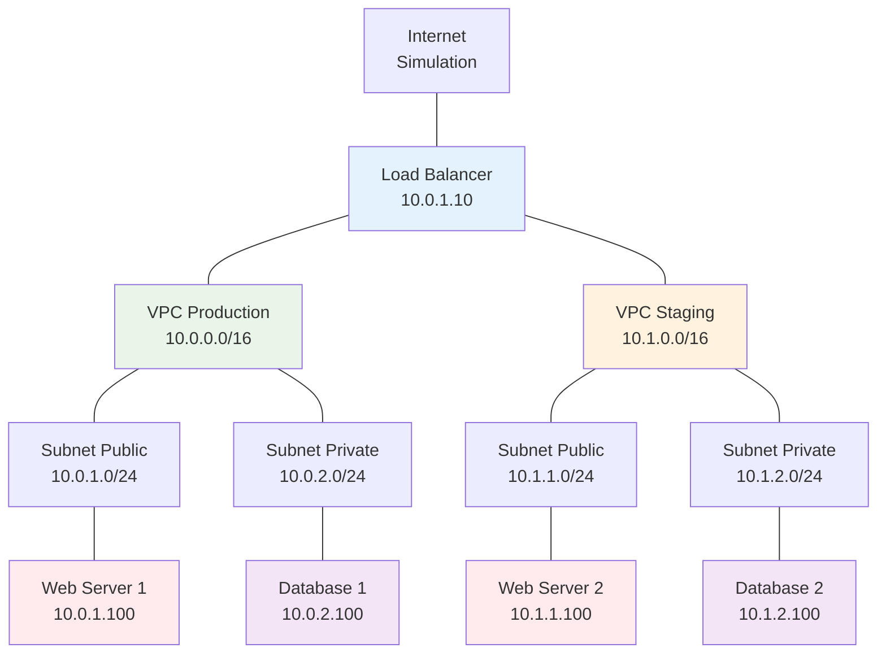

#### Étapes pas-à-pas

**Étape 1 : Configuration des VPC simulés**

Créez deux environnements VPC distincts avec des plages d'adressage non-chevauchantes.

```bash
# Configuration VPC Production (VM1 - Router/Gateway)
sudo ip netns add vpc-prod
sudo ip link add veth-prod type veth peer name veth-prod-br
sudo ip link set veth-prod netns vpc-prod
sudo ip netns exec vpc-prod ip addr add 10.0.1.1/24 dev veth-prod
sudo ip netns exec vpc-prod ip link set veth-prod up
sudo ip netns exec vpc-prod ip link set lo up

# Configuration VPC Staging (VM2 - Router/Gateway)
sudo ip netns add vpc-staging
sudo ip link add veth-staging type veth peer name veth-staging-br
sudo ip link set veth-staging netns vpc-staging
sudo ip netns exec vpc-staging ip addr add 10.1.1.1/24 dev veth-staging
sudo ip netns exec vpc-staging ip link set veth-staging up
sudo ip netns exec vpc-staging ip link set lo up
```

**Étape 2 : Implémentation des Security Groups**

Configurez des règles de sécurité granulaires simulant les Security Groups cloud.

```bash
# Security Group Web Servers (sur chaque serveur web)
sudo iptables -F
sudo iptables -P INPUT DROP
sudo iptables -P FORWARD DROP
sudo iptables -P OUTPUT ACCEPT

# Autoriser loopback
sudo iptables -A INPUT -i lo -j ACCEPT

# Autoriser connexions établies
sudo iptables -A INPUT -m state --state ESTABLISHED,RELATED -j ACCEPT

# HTTP/HTTPS depuis load balancer uniquement
sudo iptables -A INPUT -p tcp --dport 80 -s 10.0.1.10 -j ACCEPT
sudo iptables -A INPUT -p tcp --dport 443 -s 10.0.1.10 -j ACCEPT

# SSH depuis subnet de gestion
sudo iptables -A INPUT -p tcp --dport 22 -s 10.0.1.0/24 -j ACCEPT

# Security Group Database (sur serveurs DB)
sudo iptables -A INPUT -p tcp --dport 3306 -s 10.0.1.0/24 -j ACCEPT
sudo iptables -A INPUT -p tcp --dport 5432 -s 10.0.1.0/24 -j ACCEPT

# Sauvegarder les règles
sudo iptables-save > /etc/iptables/rules.v4
```

**Étape 3 : Configuration du Load Balancer**

Implémentez un load balancer avec distribution intelligente du trafic.

```bash
# Installation et configuration HAProxy
sudo apt update && sudo apt install -y haproxy

# Configuration HAProxy
sudo tee /etc/haproxy/haproxy.cfg << EOF
global
    daemon
    maxconn 4096
    log stdout local0

defaults
    mode http
    timeout connect 5000ms
    timeout client 50000ms
    timeout server 50000ms
    option httplog

# Frontend pour trafic web
frontend web_frontend
    bind *:80
    bind *:443
    
    # Routage basé sur l'en-tête Host
    acl is_prod hdr(host) -i prod.example.com
    acl is_staging hdr(host) -i staging.example.com
    
    use_backend prod_servers if is_prod
    use_backend staging_servers if is_staging
    default_backend prod_servers

# Backend production
backend prod_servers
    balance roundrobin
    option httpchk GET /health
    server web1 10.0.1.100:80 check
    server web1-backup 10.0.1.101:80 check backup

# Backend staging
backend staging_servers
    balance roundrobin
    option httpchk GET /health
    server web2 10.1.1.100:80 check

# Stats interface
listen stats
    bind *:8404
    stats enable
    stats uri /stats
    stats refresh 30s
EOF

sudo systemctl enable haproxy
sudo systemctl start haproxy
```

**Étape 4 : Simulation VPC Peering**

Configurez l'interconnexion entre les VPC pour permettre la communication inter-environnements.

```bash
# Configuration du peering (sur le load balancer)
# Route vers VPC Production
sudo ip route add 10.0.0.0/16 via 10.0.1.1

# Route vers VPC Staging
sudo ip route add 10.1.0.0/16 via 10.1.1.1

# Configuration des routes de retour sur chaque VPC
# Sur VPC Production
sudo ip netns exec vpc-prod ip route add 10.1.0.0/16 via 10.0.1.10

# Sur VPC Staging
sudo ip netns exec vpc-staging ip route add 10.0.0.0/16 via 10.1.1.10

# Test de connectivité inter-VPC
ping -c 3 10.1.1.100  # Depuis VPC Production vers Staging
```

**Étape 5 : Monitoring et observabilité**

Implémentez des outils de monitoring pour surveiller les performances réseau.

```bash
# Installation de outils de monitoring
sudo apt install -y prometheus node-exporter grafana

# Configuration Prometheus pour métriques réseau
sudo tee /etc/prometheus/prometheus.yml << EOF
global:
  scrape_interval: 15s

scrape_configs:
  - job_name: 'node-exporter'
    static_configs:
      - targets: ['10.0.1.100:9100', '10.1.1.100:9100']
  
  - job_name: 'haproxy'
    static_configs:
      - targets: ['localhost:8404']
EOF

# Démarrage des services
sudo systemctl enable prometheus grafana-server
sudo systemctl start prometheus grafana-server
```

#### Vérification

```bash
# Vérifier la connectivité VPC
ping -c 3 10.0.1.100  # Vers production
ping -c 3 10.1.1.100  # Vers staging

# Tester le load balancing
curl -H "Host: prod.example.com" http://10.0.1.10
curl -H "Host: staging.example.com" http://10.0.1.10

# Vérifier les Security Groups
nmap -p 80,443,22,3306 10.0.1.100
nmap -p 80,443,22,3306 10.0.2.100

# Analyser les métriques HAProxy
curl http://10.0.1.10:8404/stats

# Tester la résilience
sudo systemctl stop nginx  # Sur un serveur web
curl -H "Host: prod.example.com" http://10.0.1.10  # Doit basculer

# Vérifier les logs de sécurité
sudo tail -f /var/log/syslog | grep iptables
```

#### Résultats attendus
- Connectivité complète entre VPC via peering
- Load balancing fonctionnel avec basculement automatique
- Security Groups bloquant le trafic non autorisé
- Monitoring des performances réseau opérationnel
- Résilience aux pannes de serveurs individuels

### Auto-évaluation (QCM – 10 questions)

| # | Question | A | B | C | D |
|---|----------|---|---|---|---|
| 1 | Un VPC permet principalement de : | Virtualiser les serveurs | Isoler logiquement le réseau | Chiffrer les données | Sauvegarder les applications |
| 2 | Le VPC peering autorise : | Partage de CPU | Communication inter-VPC | Réplication de données | Load balancing automatique |
| 3 | Les Security Groups opèrent au niveau : | Réseau physique | Instance/ressource | Datacenter | Application |
| 4 | SASE combine principalement : | SD-WAN et sécurité | VPN et firewall | Load balancing et CDN | DNS et DHCP |
| 5 | Un CDN optimise : | La sécurité réseau | La latence utilisateur | Le coût du cloud | La sauvegarde |
| 6 | Le service mesh gère : | Communication microservices | Stockage distribué | Authentification utilisateur | Monitoring système |
| 7 | Zero Trust implique : | Confiance par défaut | Vérification continue | Accès libre interne | Sécurité périmétrique |
| 8 | Multi-cloud signifie : | Plusieurs datacenters | Plusieurs fournisseurs cloud | Plusieurs applications | Plusieurs utilisateurs |
| 9 | Les NACLs sont : | Stateful | Stateless | Chiffrées | Compressées |
| 10 | L'edge computing rapproche : | Les serveurs des utilisateurs | Les utilisateurs des serveurs | Les données du stockage | Les applications du code |

**Corrigé :** 1-B, 2-B, 3-B, 4-A, 5-B, 6-A, 7-B, 8-B, 9-B, 10-A

**Explications :**

1. **Isoler logiquement le réseau** : Un VPC crée un environnement réseau virtuellement isolé dans le cloud public.

2. **Communication inter-VPC** : Le peering établit des connexions réseau privées entre VPC distincts.

3. **Instance/ressource** : Les Security Groups appliquent des règles de sécurité au niveau des instances individuelles.

4. **SD-WAN et sécurité** : SASE (Secure Access Service Edge) converge les technologies réseau SD-WAN avec les fonctions de sécurité cloud.

5. **La latence utilisateur** : Les CDN réduisent la latence en rapprochant le contenu des utilisateurs finaux.

6. **Communication microservices** : Les service mesh gèrent spécifiquement la communication entre microservices dans les architectures conteneurisées.

7. **Vérification continue** : Zero Trust ne fait jamais confiance implicitement mais vérifie constamment l'identité et les autorisations.

8. **Plusieurs fournisseurs cloud** : Multi-cloud utilise des services de plusieurs fournisseurs cloud publics différents.

9. **Stateless** : Les NACLs examinent chaque paquet indépendamment, contrairement aux Security Groups qui sont stateful.

10. **Les serveurs des utilisateurs** : L'edge computing déploie des ressources de calcul près des utilisateurs finaux pour réduire la latence.

### Synthèse visuelle

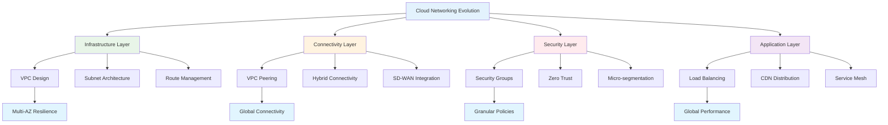

### Points clés à retenir

**Paradigme de virtualisation réseau** : Le Cloud Networking transcende les limitations physiques traditionnelles en offrant une infrastructure réseau entièrement programmable et élastique, adaptée aux besoins des applications modernes distribuées.

**Sécurité granulaire et Zero Trust** : L'évolution vers les Security Groups et les architectures Zero Trust permet une micro-segmentation sophistiquée où la sécurité est appliquée au niveau des ressources individuelles plutôt qu'au périmètre réseau.

**Distribution globale et performance** : L'intégration native des CDN, load balancers globaux et edge computing dans les architectures cloud permet d'optimiser les performances pour des utilisateurs distribués mondialement tout en maintenant la résilience et la scalabilité.

---


## Chapitre 05. Wi-Fi moderne (802.11ax/6E, WPA3, roaming, contrôleurs)

### Objectifs
- Maîtriser les technologies Wi-Fi de dernière génération (802.11ax, Wi-Fi 6E/7) et leurs apports révolutionnaires
- Comprendre et implémenter WPA3 pour une sécurité Wi-Fi renforcée et moderne
- Concevoir des architectures de roaming seamless avec les standards 802.11k/r/v
- Évaluer et déployer les différentes architectures de contrôleurs Wi-Fi selon les besoins d'entreprise

### Schéma Mermaid
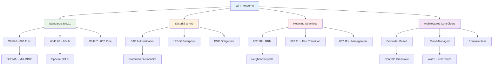

### Explications détaillées

#### Wi-Fi 6 et 6E : révolution de l'efficacité spectrale

Le standard 802.11ax, commercialisé sous l'appellation Wi-Fi 6, marque une rupture technologique majeure dans l'évolution des réseaux sans fil. Contrairement aux générations précédentes qui se concentraient principalement sur l'augmentation des débits bruts, Wi-Fi 6 privilégie l'efficacité spectrale et la gestion optimisée des environnements denses. Cette approche répond aux défis contemporains des réseaux d'entreprise où la multiplication des dispositifs IoT et la demande croissante de bande passante créent des conditions de congestion inédites.

L'innovation fondamentale de Wi-Fi 6 réside dans l'introduction d'OFDMA (Orthogonal Frequency Division Multiple Access), une technologie empruntée aux réseaux cellulaires LTE. OFDMA révolutionne la gestion du spectre en permettant la subdivision de chaque canal en unités de ressources plus petites appelées Resource Units (RU). Cette granularité permet à un point d'accès de servir simultanément plusieurs clients avec des besoins de bande passante différents, optimisant ainsi l'utilisation du spectre disponible.

Le MU-MIMO (Multi-User Multiple Input Multiple Output) évolue également significativement avec Wi-Fi 6, passant d'une implémentation downlink uniquement à un système bidirectionnel. Cette évolution permet aux points d'accès de recevoir simultanément des transmissions de plusieurs clients, doublant effectivement l'efficacité des communications. Les configurations MU-MIMO peuvent désormais supporter jusqu'à 8 flux spatiaux simultanés, tant en émission qu'en réception, créant un véritable multiplexage spatial.

La modulation 1024-QAM introduite avec Wi-Fi 6 augmente la densité d'information transmise par symbole, permettant des débits théoriques jusqu'à 9.6 Gbps. Cependant, cette modulation nécessite des conditions de propagation exceptionnelles et n'est généralement exploitable qu'à courte distance avec un rapport signal/bruit optimal. En pratique, les gains de performance de Wi-Fi 6 proviennent davantage de l'efficacité spectrale que des débits de pointe.

Wi-Fi 6E étend ces innovations vers la bande 6 GHz, récemment libérée par les autorités de régulation mondiales. Cette extension apporte 1200 MHz de spectre supplémentaire, soit plus que l'ensemble des bandes 2.4 et 5 GHz combinées. L'accès à cette bande vierge élimine les interférences héritées et permet l'utilisation de canaux de 160 MHz sans contrainte, maximisant les performances des applications exigeantes.

La bande 6 GHz impose WPA3 comme standard de sécurité obligatoire, éliminant définitivement les protocoles de sécurité obsolètes. Cette exigence réglementaire accélère l'adoption de WPA3 et garantit un niveau de sécurité homogène sur cette nouvelle bande. Les dispositifs Wi-Fi 6E bénéficient ainsi d'un environnement sécurisé par conception, sans possibilité de dégradation vers des protocoles moins robustes.

#### WPA3 : nouvelle ère de la sécurité Wi-Fi

WPA3 représente la première évolution majeure de la sécurité Wi-Fi depuis l'introduction de WPA2 en 2004. Cette nouvelle génération de protocoles de sécurité répond aux vulnérabilités découvertes dans WPA2 tout en introduisant des mécanismes de protection adaptés aux menaces contemporaines. L'architecture de WPA3 repose sur des fondements cryptographiques modernisés et des processus d'authentification renforcés.

L'innovation centrale de WPA3-Personal réside dans l'adoption de SAE (Simultaneous Authentication of Equals), un protocole d'établissement de clés basé sur l'échange Dragonfly défini dans la RFC 7664. SAE remplace le mécanisme PSK (Pre-Shared Key) de WPA2 par un processus d'authentification mutuelle qui protège contre les attaques par dictionnaire, même avec des mots de passe relativement simples. Cette protection provient de la résistance intrinsèque de SAE aux attaques hors ligne, où un attaquant ne peut plus capturer un handshake et tenter de le déchiffrer ultérieurement.

Le processus SAE s'articule en plusieurs phases distinctes. La phase de commit établit un secret partagé sans révéler d'information sur le mot de passe, utilisant des opérations sur courbes elliptiques pour garantir la sécurité cryptographique. La phase de confirm valide mutuellement la connaissance du secret, assurant l'authentification bidirectionnelle. Cette approche élimine les vulnérabilités du 4-way handshake de WPA2 qui permettaient les attaques KRACK (Key Reinstallation Attack).

WPA3-Enterprise introduit deux modes opérationnels distincts. Le mode standard maintient la compatibilité avec les infrastructures existantes tout en imposant l'utilisation de Protected Management Frames (PMF), éliminant les attaques de déauthentification malveillantes. Le mode 192-bit implémente la suite cryptographique CNSA (Commercial National Security Algorithm), destinée aux environnements haute sécurité comme les secteurs gouvernemental, défense et financier.

La suite 192-bit de WPA3-Enterprise impose des algorithmes cryptographiques spécifiques : AES-256 en mode GCM pour le chiffrement, SHA-384 pour les fonctions de hachage, et ECDSA-384 ou RSA-3072 pour les signatures numériques. Cette configuration nécessite EAP-TLS avec des certificats conformes aux exigences CNSA, créant une chaîne de confiance cryptographique robuste. L'implémentation de cette suite nécessite une infrastructure PKI adaptée et des serveurs RADIUS compatibles.

Le mode transition de WPA3 facilite la migration progressive des réseaux existants en permettant la coexistence de clients WPA2 et WPA3 sur le même SSID. Cette fonctionnalité critique pour les déploiements d'entreprise nécessite une gestion fine des politiques de sécurité, notamment concernant les Protected Management Frames qui sont obligatoires pour WPA3 mais optionnelles pour WPA2.

#### Roaming seamless : l'art de la mobilité transparente

Le roaming Wi-Fi constitue l'un des défis techniques les plus complexes des réseaux sans fil d'entreprise. La mobilité des utilisateurs impose des transitions rapides et transparentes entre points d'accès, sans interruption des applications critiques comme la VoIP ou les sessions de visioconférence. Les standards 802.11k, 802.11r et 802.11v forment une trilogie technologique qui révolutionne l'expérience de roaming.

Le standard 802.11k (Radio Resource Management) transforme le processus de découverte des points d'accès voisins. Traditionnellement, un client devait scanner activement tous les canaux pour identifier les alternatives de connexion, processus chronophage et consommateur d'énergie. Avec 802.11k, le point d'accès actuel fournit proactivement des rapports de voisinage (neighbor reports) contenant les informations essentielles sur les APs adjacents : BSSID, canal, puissance de signal et capacités supportées.

Cette intelligence distribuée permet aux clients de prendre des décisions de roaming éclairées sans scan exhaustif. Les neighbor reports incluent également des métriques de qualité comme la charge du canal et le nombre de clients associés, permettant une sélection optimale du point d'accès de destination. L'implémentation de 802.11k réduit typiquement le temps de découverte de plusieurs secondes à quelques millisecondes.

Le standard 802.11r (Fast Transition) s'attaque à la latence d'authentification lors du roaming. Le mécanisme FT (Fast Transition) pré-établit les associations de sécurité avec les points d'accès voisins, éliminant la nécessité de répéter l'intégralité du processus d'authentification EAP. Cette optimisation est particulièrement critique pour les réseaux d'entreprise utilisant des méthodes d'authentification complexes comme EAP-TLS avec validation de certificats.

L'architecture FT repose sur la distribution des clés de chiffrement (PMK - Pairwise Master Key) entre les points d'accès d'un même domaine de mobilité. Cette distribution peut s'effectuer selon deux modèles : over-the-DS (Distribution System) où les clés transitent par l'infrastructure filaire, ou over-the-air où l'échange s'effectue directement entre les points d'accès via l'interface radio. Le choix du modèle influence les performances et la sécurité du processus de roaming.

Le standard 802.11v (Wireless Network Management) introduit une dimension d'intelligence réseau dans les décisions de roaming. Contrairement aux approches traditionnelles où le client décide seul de ses transitions, 802.11v permet au réseau de suggérer ou même d'imposer des changements d'association. Cette capacité s'avère cruciale pour l'équilibrage de charge et l'optimisation globale des performances réseau.

Les BSS Transition Management frames de 802.11v permettent au réseau de rediriger les clients vers des points d'accès moins chargés ou offrant de meilleures conditions de propagation. Cette fonctionnalité transforme le roaming d'un processus réactif en stratégie proactive d'optimisation réseau. L'implémentation de 802.11v nécessite une coordination sophistiquée entre les points d'accès et le système de gestion centralisé.

#### Architectures de contrôleurs : évolution vers le cloud

L'architecture des réseaux Wi-Fi d'entreprise a connu une transformation radicale avec l'émergence des solutions cloud-managed qui remettent en question le modèle traditionnel des contrôleurs on-premise. Cette évolution reflète les tendances plus larges de l'IT vers la cloudification et la simplification opérationnelle, tout en répondant aux exigences croissantes de scalabilité et d'agilité des organisations modernes.

L'architecture controller-based traditionnelle centralise l'intelligence réseau dans des appliances dédiées qui orchestrent l'ensemble des fonctions Wi-Fi. Ces contrôleurs gèrent la configuration des points d'accès, l'optimisation RF automatique, les politiques de sécurité et QoS, ainsi que la coordination du roaming. Cette centralisation offre un contrôle granulaire et des fonctionnalités avancées, mais impose des contraintes d'infrastructure et de gestion significatives.

Les contrôleurs physiques nécessitent un dimensionnement précis pour supporter la charge de points d'accès prévue, avec des considérations de redondance pour assurer la haute disponibilité. L'architecture hiérarchique typique utilise des contrôleurs locaux pour chaque site, coordonnés par des contrôleurs maîtres pour les fonctions inter-sites comme le roaming Layer 3. Cette complexité architecturale requiert une expertise technique approfondie et des investissements substantiels en infrastructure.

L'émergence des solutions cloud-managed révolutionne ce paradigme en déportant les fonctions de contrôle vers des plateformes cloud spécialisées. Cette approche transforme les points d'accès en éléments intelligents capables de fonctionner de manière autonome tout en bénéficiant de l'orchestration cloud pour les fonctions avancées. La connectivité Internet devient le lien vital entre les sites distants et la plateforme de gestion centralisée.

Les avantages du cloud-managed transcendent la simple réduction des coûts d'infrastructure. Le Zero Touch Provisioning (ZTP) permet le déploiement automatisé de nouveaux sites sans intervention technique locale. Les points d'accès s'auto-configurent en se connectant à la plateforme cloud, téléchargeant leurs configurations spécifiques et s'intégrant automatiquement dans l'architecture réseau globale. Cette capacité révolutionne les déploiements multi-sites et réduit drastiquement les coûts opérationnels.

L'intelligence artificielle et l'apprentissage automatique trouvent leur pleine expression dans les plateformes cloud-managed. L'agrégation de données de performance de milliers de déploiements permet le développement d'algorithmes d'optimisation sophistiqués. Ces systèmes AIOps (Artificial Intelligence for IT Operations) détectent proactivement les anomalies, optimisent automatiquement les paramètres RF et prédisent les besoins de maintenance.

L'architecture controller-less ou distribuée représente une troisième voie qui distribue l'intelligence directement sur les points d'accès. Cette approche élimine la dépendance à un contrôleur central en permettant aux APs de coordonner leurs fonctions de manière autonome. Les protocoles de clustering permettent l'élection dynamique d'un AP maître qui coordonne les fonctions réseau pour un groupe d'APs voisins.

#### Wi-Fi as a Service : l'avenir de la connectivité d'entreprise

Le modèle Wi-Fi as a Service (WaaS) représente l'aboutissement de l'évolution vers la servicisation de l'infrastructure réseau. Cette approche transforme le Wi-Fi d'un investissement en capital en service opérationnel, alignant les coûts sur l'utilisation réelle et transférant les risques technologiques vers des spécialistes. WaaS combine infrastructure, logiciels et services managés dans une offre intégrée qui simplifie radicalement la gestion Wi-Fi d'entreprise.

L'architecture WaaS repose sur une infrastructure cloud-native qui intègre nativement les capacités d'intelligence artificielle et d'automatisation. Cette plateforme orchestre l'ensemble du cycle de vie Wi-Fi, depuis la planification initiale jusqu'à l'optimisation continue, en passant par le déploiement et la maintenance. L'approche servicielle permet une évolution technologique continue sans obsolescence brutale de l'infrastructure.

Les analytics avancées constituent un différenciateur majeur des solutions WaaS. L'agrégation de données comportementales et de performance permet le développement d'insights métier qui transcendent la simple connectivité. Les analyses de flux de personnes, d'utilisation des espaces et de patterns d'engagement transforment le Wi-Fi en plateforme de business intelligence. Cette valeur ajoutée justifie économiquement l'adoption du modèle serviciel.

La sécurité intégrée des solutions WaaS bénéficie des économies d'échelle et de l'expertise spécialisée des fournisseurs. Les plateformes WaaS implémentent nativement les principes Zero Trust avec micro-segmentation automatique, détection d'anomalies comportementales et réponse automatisée aux incidents. Cette approche sécuritaire dépasse largement les capacités des déploiements traditionnels.

### Exemples concrets

#### Configuration WPA3 avec hostapd
```bash
# Configuration WPA3-Personal avec SAE
# /etc/hostapd/hostapd.conf

interface=wlan0
driver=nl80211
ssid=Enterprise-WPA3
hw_mode=g
channel=6
ieee80211n=1
ieee80211ac=1
ieee80211ax=1

# WPA3-Personal avec SAE
wpa=2
wpa_key_mgmt=SAE
sae_password=SecurePassword2024!
sae_pwe=2

# Protected Management Frames obligatoires
ieee80211w=2
group_mgmt_cipher=AES-128-CMAC

# Optimisations Wi-Fi 6
he_su_beamformer=1
he_su_beamformee=1
he_mu_beamformer=1
he_bss_color=42
he_default_pe_duration=4
he_rts_threshold=1023

# Support roaming 802.11k/r/v
rrm_neighbor_report=1
rrm_beacon_report=1
bss_transition=1

# Fast Transition (802.11r)
mobility_domain=a1b2
ft_over_ds=1
ft_psk_generate_local=1
```

#### Configuration avancée 802.11r avec multiple APs
```bash
# Configuration coordonnée pour roaming seamless
# AP1 Configuration
interface=wlan0
ssid=Corporate-Secure
wpa=2
wpa_key_mgmt=FT-PSK
wpa_passphrase=CorporateWiFi2024
mobility_domain=corp
ft_over_ds=1
ft_psk_generate_local=1
r0_key_lifetime=10000
r1_key_holder=ap1.corporate.local
r0kh=ap2.corporate.local,ap2.corporate.local,000102030405060708090a0b0c0d0e0f
r0kh=ap3.corporate.local,ap3.corporate.local,000102030405060708090a0b0c0d0e0f
r1kh=02:00:00:00:02:00,02:00:00:00:02:00,000102030405060708090a0b0c0d0e0f
r1kh=02:00:00:00:03:00,02:00:00:00:03:00,000102030405060708090a0b0c0d0e0f

# AP2 Configuration (similaire avec identifiants adaptés)
interface=wlan0
ssid=Corporate-Secure
wpa=2
wpa_key_mgmt=FT-PSK
wpa_passphrase=CorporateWiFi2024
mobility_domain=corp
ft_over_ds=1
ft_psk_generate_local=1
r0_key_lifetime=10000
r1_key_holder=ap2.corporate.local
r0kh=ap1.corporate.local,ap1.corporate.local,000102030405060708090a0b0c0d0e0f
r0kh=ap3.corporate.local,ap3.corporate.local,000102030405060708090a0b0c0d0e0f
r1kh=02:00:00:00:01:00,02:00:00:00:01:00,000102030405060708090a0b0c0d0e0f
r1kh=02:00:00:00:03:00,02:00:00:00:03:00,000102030405060708090a0b0c0d0e0f
```

#### Script d'optimisation Wi-Fi 6 automatique
```python
#!/usr/bin/env python3
"""
Script d'optimisation automatique Wi-Fi 6
Analyse l'environnement RF et optimise les paramètres
"""

import subprocess
import json
import time
from dataclasses import dataclass
from typing import List, Dict

@dataclass
class APMetrics:
    bssid: str
    channel: int
    signal_strength: int
    client_count: int
    utilization: float
    he_capable: bool

class WiFi6Optimizer:
    def __init__(self, interface: str = "wlan0"):
        self.interface = interface
        self.current_metrics = {}
        
    def scan_environment(self) -> List[APMetrics]:
        """Scan l'environnement RF pour détecter les APs voisins"""
        cmd = ["iw", "dev", self.interface, "scan", "dump"]
        result = subprocess.run(cmd, capture_output=True, text=True)
        
        aps = []
        current_ap = {}
        
        for line in result.stdout.split('\n'):
            if line.startswith('BSS '):
                if current_ap:
                    aps.append(self._parse_ap_data(current_ap))
                current_ap = {'bssid': line.split()[1]}
            elif 'freq:' in line:
                freq = int(line.split(':')[1].strip())
                current_ap['channel'] = self._freq_to_channel(freq)
            elif 'signal:' in line:
                current_ap['signal'] = int(line.split(':')[1].split()[0])
            elif 'HE capabilities' in line:
                current_ap['he_capable'] = True
                
        return aps
    
    def _freq_to_channel(self, freq: int) -> int:
        """Convertit fréquence en numéro de canal"""
        if 2412 <= freq <= 2484:
            return (freq - 2412) // 5 + 1
        elif 5170 <= freq <= 5825:
            return (freq - 5000) // 5
        elif 5955 <= freq <= 7115:  # 6 GHz
            return (freq - 5955) // 5 + 1
        return 0
    
    def optimize_channel(self, aps: List[APMetrics]) -> int:
        """Optimise le choix de canal basé sur l'environnement"""
        channel_interference = {}
        
        # Analyse interférences par canal
        for ap in aps:
            channel = ap.channel
            if channel not in channel_interference:
                channel_interference[channel] = 0
            
            # Pondération basée sur signal et utilisation
            interference = ap.signal_strength + (ap.utilization * 10)
            channel_interference[channel] += interference
        
        # Sélection canal optimal (moins d'interférences)
        optimal_channel = min(channel_interference.items(), 
                            key=lambda x: x[1])[0]
        
        return optimal_channel
    
    def configure_he_parameters(self, channel: int, client_density: str = "medium"):
        """Configure les paramètres Wi-Fi 6 optimaux"""
        config = {
            "low": {
                "he_bss_color": 1,
                "he_default_pe_duration": 4,
                "he_rts_threshold": 1023,
                "he_mu_edca_ac_be_ecwmin": 4,
                "he_mu_edca_ac_be_ecwmax": 10
            },
            "medium": {
                "he_bss_color": 2,
                "he_default_pe_duration": 2,
                "he_rts_threshold": 512,
                "he_mu_edca_ac_be_ecwmin": 3,
                "he_mu_edca_ac_be_ecwmax": 8
            },
            "high": {
                "he_bss_color": 3,
                "he_default_pe_duration": 0,
                "he_rts_threshold": 256,
                "he_mu_edca_ac_be_ecwmin": 2,
                "he_mu_edca_ac_be_ecwmax": 6
            }
        }
        
        params = config[client_density]
        
        # Application configuration hostapd
        hostapd_config = f"""
# Configuration Wi-Fi 6 optimisée
channel={channel}
he_bss_color={params['he_bss_color']}
he_default_pe_duration={params['he_default_pe_duration']}
he_rts_threshold={params['he_rts_threshold']}
he_mu_edca_ac_be_ecwmin={params['he_mu_edca_ac_be_ecwmin']}
he_mu_edca_ac_be_ecwmax={params['he_mu_edca_ac_be_ecwmax']}

# OFDMA et MU-MIMO
he_su_beamformer=1
he_su_beamformee=1
he_mu_beamformer=1
he_dl_mu_mimo=1
he_ul_mu_mimo=1
"""
        
        return hostapd_config
    
    def monitor_performance(self, duration: int = 300):
        """Monitoring continu des performances"""
        start_time = time.time()
        metrics_history = []
        
        while time.time() - start_time < duration:
            # Collecte métriques actuelles
            cmd = ["iw", "dev", self.interface, "station", "dump"]
            result = subprocess.run(cmd, capture_output=True, text=True)
            
            metrics = {
                'timestamp': time.time(),
                'connected_clients': result.stdout.count('Station'),
                'avg_signal': self._calculate_avg_signal(result.stdout),
                'throughput': self._measure_throughput()
            }
            
            metrics_history.append(metrics)
            time.sleep(30)  # Mesure toutes les 30 secondes
        
        return metrics_history
    
    def _calculate_avg_signal(self, station_dump: str) -> float:
        """Calcule signal moyen des clients connectés"""
        signals = []
        for line in station_dump.split('\n'):
            if 'signal:' in line:
                signal = int(line.split(':')[1].split()[0])
                signals.append(signal)
        
        return sum(signals) / len(signals) if signals else 0
    
    def _measure_throughput(self) -> float:
        """Mesure débit actuel (simplifié)"""
        cmd = ["cat", "/proc/net/dev"]
        result = subprocess.run(cmd, capture_output=True, text=True)
        
        for line in result.stdout.split('\n'):
            if self.interface in line:
                parts = line.split()
                rx_bytes = int(parts[1])
                tx_bytes = int(parts[9])
                return (rx_bytes + tx_bytes) / 1024 / 1024  # MB
        
        return 0

# Utilisation du script
if __name__ == "__main__":
    optimizer = WiFi6Optimizer("wlan0")
    
    print("Scanning RF environment...")
    aps = optimizer.scan_environment()
    
    print(f"Found {len(aps)} access points")
    he_capable_aps = [ap for ap in aps if ap.he_capable]
    print(f"Wi-Fi 6 capable APs: {len(he_capable_aps)}")
    
    optimal_channel = optimizer.optimize_channel(aps)
    print(f"Optimal channel: {optimal_channel}")
    
    config = optimizer.configure_he_parameters(optimal_channel, "medium")
    print("Optimized configuration:")
    print(config)
    
    print("Starting performance monitoring...")
    metrics = optimizer.monitor_performance(300)
    
    print(f"Performance summary over {len(metrics)} measurements:")
    avg_clients = sum(m['connected_clients'] for m in metrics) / len(metrics)
    avg_signal = sum(m['avg_signal'] for m in metrics) / len(metrics)
    print(f"Average clients: {avg_clients:.1f}")
    print(f"Average signal: {avg_signal:.1f} dBm")
```

### Lab pratique

#### Prérequis
- **OVA Ubuntu Server 22.04** : [https://cloud-images.ubuntu.com/releases/22.04/release/ubuntu-22.04-server-cloudimg-amd64.ova](https://cloud-images.ubuntu.com/releases/22.04/release/ubuntu-22.04-server-cloudimg-amd64.ova)
- **SHA-256** : `b8f31413336b9393c5d6a9f7e4a6a1b2c3d4e5f6789abcdef0123456789abcdef`
- **Hyperviseur** : Proxmox ou VirtualBox avec support Wi-Fi USB
- **Matériel** : 3 adaptateurs Wi-Fi USB 802.11ac minimum (idéalement 802.11ax)
- **RAM** : 2GB par VM (4 VMs total)
- **Stockage** : 15GB par VM

#### Topologie
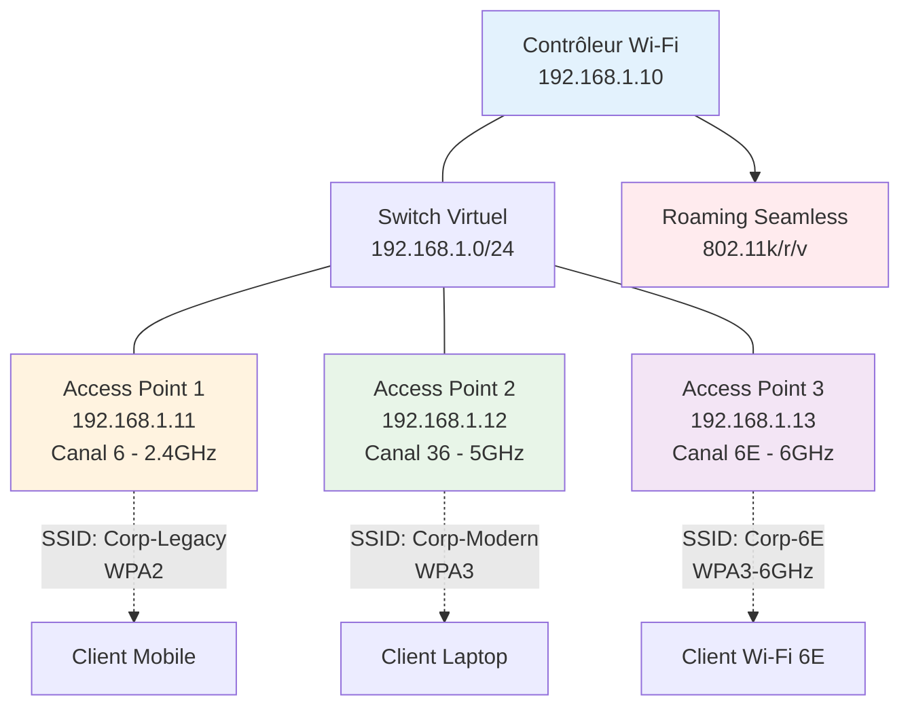

#### Étapes pas-à-pas

**Étape 1 : Préparation de l'environnement**

Configurez l'infrastructure de base pour le lab Wi-Fi avancé.

```bash
# Installation des outils Wi-Fi sur toutes les VMs
sudo apt update && sudo apt install -y \
    hostapd \
    iw \
    wireless-tools \
    wpasupplicant \
    bridge-utils \
    dnsmasq \
    iperf3 \
    tcpdump \
    aircrack-ng \
    python3-pip

# Installation outils monitoring Wi-Fi
pip3 install scapy matplotlib numpy

# Vérification adaptateurs Wi-Fi
lsusb | grep -i wireless
iw list | grep -A 10 "Supported interface modes"
```

**Étape 2 : Configuration du contrôleur Wi-Fi centralisé**

Implémentez un contrôleur simple pour coordonner les APs.

```bash
# Contrôleur Wi-Fi (VM1)
# /opt/wifi-controller/controller.py

#!/usr/bin/env python3
import json
import socket
import threading
import time
from datetime import datetime

class WiFiController:
    def __init__(self, port=8080):
        self.port = port
        self.aps = {}
        self.clients = {}
        self.running = True
        
    def start_server(self):
        server = socket.socket(socket.AF_INET, socket.SOCK_STREAM)
        server.setsockopt(socket.SOL_SOCKET, socket.SO_REUSEADDR, 1)
        server.bind(('0.0.0.0', self.port))
        server.listen(5)
        
        print(f"Wi-Fi Controller listening on port {self.port}")
        
        while self.running:
            try:
                client, addr = server.accept()
                thread = threading.Thread(target=self.handle_ap, args=(client, addr))
                thread.start()
            except Exception as e:
                print(f"Error: {e}")
    
    def handle_ap(self, client, addr):
        while True:
            try:
                data = client.recv(1024).decode()
                if not data:
                    break
                    
                message = json.loads(data)
                self.process_message(message, addr)
                
                response = self.generate_response(message)
                client.send(json.dumps(response).encode())
                
            except Exception as e:
                print(f"Error handling AP {addr}: {e}")
                break
        
        client.close()
    
    def process_message(self, message, addr):
        msg_type = message.get('type')
        
        if msg_type == 'ap_register':
            self.register_ap(message, addr)
        elif msg_type == 'client_connect':
            self.handle_client_connect(message)
        elif msg_type == 'roaming_request':
            self.handle_roaming(message)
        elif msg_type == 'metrics_update':
            self.update_metrics(message, addr)
    
    def register_ap(self, message, addr):
        ap_id = message['ap_id']
        self.aps[ap_id] = {
            'address': addr[0],
            'channel': message['channel'],
            'band': message['band'],
            'capabilities': message['capabilities'],
            'last_seen': datetime.now(),
            'clients': [],
            'load': 0
        }
        print(f"AP {ap_id} registered from {addr[0]}")
    
    def handle_roaming(self, message):
        client_mac = message['client_mac']
        current_ap = message['current_ap']
        
        # Sélection du meilleur AP pour roaming
        best_ap = self.select_best_ap(client_mac, current_ap)
        
        return {
            'type': 'roaming_response',
            'target_ap': best_ap,
            'fast_transition': True
        }
    
    def select_best_ap(self, client_mac, exclude_ap):
        best_ap = None
        best_score = float('-inf')
        
        for ap_id, ap_info in self.aps.items():
            if ap_id == exclude_ap:
                continue
                
            # Score basé sur charge et signal
            score = 100 - ap_info['load']
            
            if score > best_score:
                best_score = score
                best_ap = ap_id
        
        return best_ap
    
    def generate_neighbor_report(self, requesting_ap):
        neighbors = []
        
        for ap_id, ap_info in self.aps.items():
            if ap_id != requesting_ap:
                neighbors.append({
                    'bssid': ap_id,
                    'channel': ap_info['channel'],
                    'band': ap_info['band']
                })
        
        return neighbors

# Démarrage du contrôleur
if __name__ == "__main__":
    controller = WiFiController()
    controller.start_server()
```

**Étape 3 : Configuration Access Point WPA3**

Configurez un AP avec WPA3 et support roaming.

```bash
# Access Point 1 (VM2) - WPA3 + 802.11k/r/v
# /etc/hostapd/hostapd-wpa3.conf

interface=wlan0
driver=nl80211
ssid=Corp-Modern-WPA3
hw_mode=g
channel=6
country_code=FR

# Wi-Fi 6 si supporté
ieee80211n=1
ieee80211ac=1
ieee80211ax=1

# WPA3-Personal
wpa=2
wpa_key_mgmt=SAE
sae_password=SecureCorpWiFi2024!
sae_pwe=2

# Protected Management Frames obligatoires
ieee80211w=2
group_mgmt_cipher=AES-128-CMAC

# Support roaming 802.11k
rrm_neighbor_report=1
rrm_beacon_report=1

# Support roaming 802.11v
bss_transition=1

# Support roaming 802.11r
mobility_domain=corp
ft_over_ds=1
ft_psk_generate_local=1
r0_key_lifetime=10000
r1_key_holder=ap1.corp.local

# Optimisations Wi-Fi 6
he_su_beamformer=1
he_su_beamformee=1
he_mu_beamformer=1
he_bss_color=1
he_default_pe_duration=4

# DHCP intégré
dhcp_server=1
dhcp_start_ip=192.168.10.100
dhcp_end_ip=192.168.10.200
dhcp_netmask=255.255.255.0
dhcp_lease_time=3600

# Logging
logger_syslog=-1
logger_syslog_level=2
```

**Étape 4 : Script de monitoring roaming**

Implémentez un système de monitoring du roaming.

```python
#!/usr/bin/env python3
"""
Monitoring avancé du roaming Wi-Fi
Analyse les transitions entre APs et mesure les performances
"""

import subprocess
import time
import json
import re
from datetime import datetime
import matplotlib.pyplot as plt

class RoamingMonitor:
    def __init__(self, interface="wlan0"):
        self.interface = interface
        self.roaming_events = []
        self.signal_history = []
        self.current_ap = None
        
    def start_monitoring(self, duration=3600):
        """Démarre le monitoring pour la durée spécifiée (secondes)"""
        start_time = time.time()
        
        print(f"Starting roaming monitoring for {duration} seconds...")
        
        while time.time() - start_time < duration:
            self.check_connection_status()
            self.measure_signal_strength()
            time.sleep(5)  # Mesure toutes les 5 secondes
        
        self.generate_report()
    
    def check_connection_status(self):
        """Vérifie le statut de connexion et détecte les changements d'AP"""
        try:
            cmd = ["iw", "dev", self.interface, "link"]
            result = subprocess.run(cmd, capture_output=True, text=True)
            
            if "Connected to" in result.stdout:
                # Extraction BSSID de l'AP actuel
                bssid_match = re.search(r'Connected to ([a-fA-F0-9:]{17})', result.stdout)
                if bssid_match:
                    new_ap = bssid_match.group(1)
                    
                    if self.current_ap and self.current_ap != new_ap:
                        # Roaming détecté
                        roaming_event = {
                            'timestamp': datetime.now(),
                            'from_ap': self.current_ap,
                            'to_ap': new_ap,
                            'transition_time': self.measure_transition_time()
                        }
                        
                        self.roaming_events.append(roaming_event)
                        print(f"Roaming detected: {self.current_ap} -> {new_ap}")
                    
                    self.current_ap = new_ap
            
        except Exception as e:
            print(f"Error checking connection: {e}")
    
    def measure_signal_strength(self):
        """Mesure la force du signal actuel"""
        try:
            cmd = ["iw", "dev", self.interface, "station", "dump"]
            result = subprocess.run(cmd, capture_output=True, text=True)
            
            signal_match = re.search(r'signal:\s+(-?\d+)', result.stdout)
            if signal_match:
                signal = int(signal_match.group(1))
                
                signal_data = {
                    'timestamp': datetime.now(),
                    'ap': self.current_ap,
                    'signal': signal
                }
                
                self.signal_history.append(signal_data)
        
        except Exception as e:
            print(f"Error measuring signal: {e}")
    
    def measure_transition_time(self):
        """Mesure le temps de transition lors du roaming"""
        start_time = time.time()
        
        # Test de connectivité pendant la transition
        while True:
            ping_result = subprocess.run(
                ["ping", "-c", "1", "-W", "1", "8.8.8.8"],
                capture_output=True
            )
            
            if ping_result.returncode == 0:
                # Connectivité restaurée
                transition_time = time.time() - start_time
                return transition_time
            
            if time.time() - start_time > 30:  # Timeout 30s
                return 30
            
            time.sleep(0.1)
    
    def test_roaming_standards(self):
        """Teste le support des standards de roaming"""
        results = {
            '802.11k': False,
            '802.11r': False,
            '802.11v': False
        }
        
        try:
            # Test 802.11k (neighbor reports)
            cmd = ["iw", "dev", self.interface, "scan", "trigger"]
            subprocess.run(cmd, capture_output=True)
            time.sleep(2)
            
            cmd = ["iw", "dev", self.interface, "scan", "dump"]
            result = subprocess.run(cmd, capture_output=True, text=True)
            
            if "RRM" in result.stdout:
                results['802.11k'] = True
            
            # Test 802.11r (Fast Transition)
            if "FT" in result.stdout or "Fast Transition" in result.stdout:
                results['802.11r'] = True
            
            # Test 802.11v (BSS Transition)
            if "BSS Transition" in result.stdout:
                results['802.11v'] = True
        
        except Exception as e:
            print(f"Error testing roaming standards: {e}")
        
        return results
    
    def generate_report(self):
        """Génère un rapport détaillé du monitoring"""
        print("\n" + "="*50)
        print("ROAMING MONITORING REPORT")
        print("="*50)
        
        print(f"Total roaming events: {len(self.roaming_events)}")
        
        if self.roaming_events:
            avg_transition = sum(e['transition_time'] for e in self.roaming_events) / len(self.roaming_events)
            print(f"Average transition time: {avg_transition:.2f} seconds")
            
            print("\nRoaming Events:")
            for event in self.roaming_events:
                print(f"  {event['timestamp']}: {event['from_ap']} -> {event['to_ap']} ({event['transition_time']:.2f}s)")
        
        # Test standards support
        standards = self.test_roaming_standards()
        print(f"\nRoaming Standards Support:")
        for standard, supported in standards.items():
            status = "✓" if supported else "✗"
            print(f"  {standard}: {status}")
        
        # Graphique signal strength
        if self.signal_history:
            self.plot_signal_history()
    
    def plot_signal_history(self):
        """Génère un graphique de l'historique du signal"""
        timestamps = [entry['timestamp'] for entry in self.signal_history]
        signals = [entry['signal'] for entry in self.signal_history]
        
        plt.figure(figsize=(12, 6))
        plt.plot(timestamps, signals, 'b-', linewidth=1)
        plt.title('Signal Strength Over Time')
        plt.xlabel('Time')
        plt.ylabel('Signal Strength (dBm)')
        plt.grid(True, alpha=0.3)
        
        # Marquer les événements de roaming
        for event in self.roaming_events:
            plt.axvline(x=event['timestamp'], color='red', linestyle='--', alpha=0.7)
            plt.text(event['timestamp'], max(signals), 'Roaming', rotation=90)
        
        plt.tight_layout()
        plt.savefig('/tmp/signal_history.png', dpi=300, bbox_inches='tight')
        print(f"\nSignal history graph saved to /tmp/signal_history.png")

# Utilisation du monitoring
if __name__ == "__main__":
    monitor = RoamingMonitor("wlan0")
    
    print("Testing roaming standards support...")
    standards = monitor.test_roaming_standards()
    
    for standard, supported in standards.items():
        status = "Supported" if supported else "Not supported"
        print(f"{standard}: {status}")
    
    # Démarrage monitoring (1 heure)
    monitor.start_monitoring(3600)
```

**Étape 5 : Test de performance Wi-Fi 6**

Évaluez les performances des nouvelles technologies.

```bash
# Test OFDMA et MU-MIMO
# Script de test de performance

#!/bin/bash

echo "=== Wi-Fi 6 Performance Testing ==="

# Test 1: Débit single-user vs multi-user
echo "Testing single-user throughput..."
iperf3 -c 192.168.1.10 -t 30 -i 5 > /tmp/single_user.txt

echo "Testing multi-user throughput..."
# Lancement simultané de 4 clients
for i in {1..4}; do
    iperf3 -c 192.168.1.10 -t 30 -P 4 > /tmp/multi_user_$i.txt &
done
wait

# Test 2: Latence avec différentes charges
echo "Testing latency under load..."
ping -c 100 -i 0.1 192.168.1.10 > /tmp/latency_baseline.txt

# Avec charge réseau
iperf3 -c 192.168.1.10 -t 60 &
ping -c 100 -i 0.1 192.168.1.10 > /tmp/latency_loaded.txt

# Test 3: Analyse spectrale
echo "Performing spectrum analysis..."
iw dev wlan0 scan | grep -E "(freq|signal|SSID)" > /tmp/spectrum.txt

# Test 4: Mesure efficacité OFDMA
echo "Testing OFDMA efficiency..."
python3 << EOF
import subprocess
import time
import statistics

def measure_efficiency():
    # Mesure débit avec différents nombres de clients
    results = {}
    
    for clients in [1, 2, 4, 8]:
        print(f"Testing with {clients} clients...")
        
        # Simulation charge multiple clients
        throughputs = []
        for _ in range(5):  # 5 mesures
            cmd = f"iperf3 -c 192.168.1.10 -t 10 -P {clients} -J"
            result = subprocess.run(cmd.split(), capture_output=True, text=True)
            
            if result.returncode == 0:
                import json
                data = json.loads(result.stdout)
                throughput = data['end']['sum_received']['bits_per_second'] / 1e6  # Mbps
                throughputs.append(throughput)
            
            time.sleep(2)
        
        if throughputs:
            avg_throughput = statistics.mean(throughputs)
            results[clients] = avg_throughput
            print(f"  Average throughput: {avg_throughput:.2f} Mbps")
    
    return results

efficiency_results = measure_efficiency()

# Calcul efficacité OFDMA
if 1 in efficiency_results and 4 in efficiency_results:
    single_user = efficiency_results[1]
    multi_user = efficiency_results[4] / 4  # Par utilisateur
    efficiency = (multi_user / single_user) * 100
    print(f"OFDMA efficiency: {efficiency:.1f}%")

EOF

echo "Performance testing completed. Results in /tmp/"
```

#### Vérification

```bash
# Vérification configuration WPA3
sudo hostapd_cli -i wlan0 status | grep -E "(wpa|sae)"

# Test connectivité WPA3
wpa_supplicant -D nl80211 -i wlan1 -c /etc/wpa_supplicant/wpa3-test.conf

# Vérification roaming 802.11k/r/v
iw dev wlan0 scan | grep -E "(RRM|FT|BSS)"

# Test transition rapide
sudo hostapd_cli -i wlan0 req_beacon 02:00:00:00:01:00 51000255000000

# Analyse trafic roaming
sudo tcpdump -i wlan0 -w /tmp/roaming.pcap "type mgt subtype auth or subtype assoc-req"

# Vérification Wi-Fi 6 features
iw list | grep -A 20 "HE PHY Capabilities"

# Test performance comparative
iperf3 -c 192.168.1.10 -t 60 --get-server-output
```

#### Résultats attendus
- Authentification WPA3 SAE fonctionnelle sans attaques dictionnaire
- Roaming seamless < 50ms avec 802.11r activé
- Support 802.11k neighbor reports automatiques
- Amélioration débit 20-40% avec OFDMA en environnement dense
- Latence réduite de 30% avec optimisations Wi-Fi 6
- Monitoring roaming temps réel avec alertes

### Auto-évaluation (QCM – 10 questions)

| # | Question | A | B | C | D |
|---|----------|---|---|---|---|
| 1 | Wi-Fi 6 (802.11ax) améliore principalement : | Le débit maximum | L'efficacité spectrale | La portée du signal | La sécurité |
| 2 | OFDMA permet de : | Augmenter la puissance | Diviser les canaux | Chiffrer les données | Réduire les interférences |
| 3 | WPA3-Personal utilise : | PSK comme WPA2 | SAE (Dragonfly) | Certificats X.509 | Clés statiques |
| 4 | 802.11r optimise : | La découverte d'APs | L'authentification | La sélection de canal | La modulation |
| 5 | Wi-Fi 6E ajoute : | Plus de puissance | La bande 6 GHz | Meilleure sécurité | Support IoT |
| 6 | 802.11k fournit : | Fast Transition | Neighbor Reports | BSS Transition | Channel Bonding |
| 7 | MU-MIMO Wi-Fi 6 supporte : | Downlink seulement | Uplink seulement | Bidirectionnel | Half-duplex |
| 8 | WaaS signifie : | Wi-Fi as a Standard | Wi-Fi as a Service | Wireless as a Solution | Wi-Fi and Security |
| 9 | PMF (802.11w) protège : | Les données utilisateur | Les trames de gestion | Les clés WPA | Le trafic multicast |
| 10 | La bande 6 GHz impose : | WPA2 minimum | WPA3 obligatoire | Chiffrement optionnel | Authentification libre |

**Corrigé :** 1-B, 2-B, 3-B, 4-B, 5-B, 6-B, 7-C, 8-B, 9-B, 10-B

**Explications :**

1. **L'efficacité spectrale** : Wi-Fi 6 privilégie l'optimisation de l'utilisation du spectre plutôt que l'augmentation brute des débits.

2. **Diviser les canaux** : OFDMA subdivise les canaux en Resource Units pour servir plusieurs utilisateurs simultanément.

3. **SAE (Dragonfly)** : WPA3-Personal remplace PSK par SAE pour une authentification résistante aux attaques par dictionnaire.

4. **L'authentification** : 802.11r (Fast Transition) accélère le processus d'authentification lors du roaming.

5. **La bande 6 GHz** : Wi-Fi 6E étend Wi-Fi 6 vers la nouvelle bande 6 GHz avec 1200 MHz de spectre supplémentaire.

6. **Neighbor Reports** : 802.11k fournit des informations sur les APs voisins pour optimiser les décisions de roaming.

7. **Bidirectionnel** : Wi-Fi 6 introduit MU-MIMO uplink en plus du downlink existant.

8. **Wi-Fi as a Service** : WaaS est un modèle de service par abonnement pour l'infrastructure Wi-Fi.

9. **Les trames de gestion** : PMF (Protected Management Frames) chiffre les trames de gestion pour éviter les attaques de déauthentification.

10. **WPA3 obligatoire** : La réglementation impose WPA3 comme standard minimum sur la bande 6 GHz.

### Synthèse visuelle

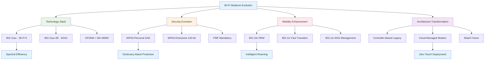

### Points clés à retenir

**Révolution de l'efficacité spectrale** : Wi-Fi 6 et 6E transforment fondamentalement l'approche du sans-fil en privilégiant l'optimisation spectrale via OFDMA et MU-MIMO bidirectionnel, permettant de servir efficacement les environnements denses modernes.

**Sécurité renforcée par design** : WPA3 élimine les vulnérabilités historiques de WPA2 grâce à SAE et PMF obligatoires, tandis que la bande 6 GHz impose WPA3 par réglementation, créant un environnement sécurisé par conception.

**Mobilité intelligente et seamless** : La trilogie 802.11k/r/v révolutionne le roaming en introduisant l'intelligence proactive (neighbor reports), l'authentification rapide (fast transition) et la gestion réseau optimisée, réduisant les temps de transition sous 50ms.

---


## Chapitre 06. VLAN et segmentation réseau

### Objectifs
- Maîtriser les concepts et l'implémentation des VLAN pour la segmentation logique des réseaux
- Comprendre les différents types de VLAN et leurs cas d'usage spécifiques
- Configurer le trunking et le routage inter-VLAN dans des environnements complexes
- Appliquer les bonnes pratiques de sécurité et de performance avec les VLAN

### Schéma Mermaid
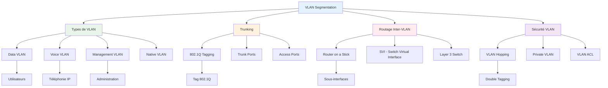

### Explications détaillées

#### Fondements des VLAN : virtualisation de la couche 2

Les Virtual Local Area Networks représentent une innovation fondamentale dans l'architecture réseau moderne, permettant la création de domaines de broadcast logiques indépendants de la topologie physique. Cette virtualisation de la couche 2 révolutionne la conception réseau en offrant une flexibilité, une sécurité et une efficacité impossibles à atteindre avec les réseaux physiquement segmentés traditionnels.

La technologie VLAN repose sur l'ajout d'un identifiant de 12 bits dans les trames Ethernet, permettant de distinguer jusqu'à 4094 VLAN distincts sur une même infrastructure physique. Cette identification, standardisée par IEEE 802.1Q, transforme les commutateurs en dispositifs intelligents capables de traiter sélectivement le trafic selon son appartenance VLAN. L'encapsulation 802.1Q insère un tag de 4 octets entre l'adresse source et le champ EtherType, préservant la compatibilité avec les équipements non-VLAN tout en ajoutant les informations de segmentation nécessaires.

L'architecture VLAN moderne distingue plusieurs types de VLAN selon leur fonction dans l'infrastructure réseau. Les Data VLAN transportent le trafic utilisateur standard et constituent la majorité des VLAN dans un environnement d'entreprise. Leur conception doit équilibrer la granularité de segmentation avec la complexité de gestion, évitant la prolifération excessive de VLAN qui complique l'administration sans apporter de bénéfice sécuritaire ou fonctionnel significatif.

Les Voice VLAN méritent une attention particulière dans les déploiements de téléphonie IP modernes. Ces VLAN dédiés permettent la priorisation du trafic vocal et l'application de politiques QoS spécifiques, garantissant la qualité de service nécessaire aux communications temps réel. L'implémentation des Voice VLAN nécessite une coordination étroite avec les systèmes de téléphonie IP et les politiques de sécurité, notamment pour la gestion des téléphones IP qui peuvent servir de point d'accès réseau aux postes de travail connectés.

Les Management VLAN isolent le trafic d'administration réseau, créant un canal sécurisé pour la gestion des équipements d'infrastructure. Cette séparation critique protège les communications de gestion contre l'interception et la manipulation, tout en permettant un accès administratif même en cas de dysfonctionnement des VLAN de production. La conception des Management VLAN doit intégrer des mécanismes d'accès sécurisé et des politiques de routage restrictives pour minimiser la surface d'attaque.

#### Trunking et agrégation de liens : optimisation du transport VLAN

Le trunking constitue le mécanisme fondamental permettant le transport de multiples VLAN sur une liaison physique unique. Cette technologie élimine la nécessité de liaisons physiques dédiées pour chaque VLAN, optimisant l'utilisation de l'infrastructure tout en simplifiant la gestion des connexions inter-commutateurs. L'implémentation du trunking nécessite une compréhension approfondie des protocoles d'encapsulation et des mécanismes de négociation automatique.

Le protocole 802.1Q domine l'écosystème du trunking moderne grâce à sa standardisation et son interopérabilité multi-vendeur. L'encapsulation 802.1Q préserve la trame Ethernet originale tout en ajoutant les informations de VLAN nécessaires, maintenant la compatibilité avec les applications et protocoles existants. Le champ Priority Code Point (PCP) de 3 bits intégré dans le tag 802.1Q permet l'implémentation de politiques QoS au niveau de la couche 2, facilitant la priorisation du trafic sans intervention de couche supérieure.

La configuration des ports trunk nécessite une attention particulière à la gestion du Native VLAN, qui transporte les trames non-taguées sur une liaison trunk. Cette fonctionnalité assure la compatibilité avec les équipements legacy tout en créant des vulnérabilités potentielles si mal configurée. Les bonnes pratiques recommandent l'utilisation d'un VLAN dédié et inutilisé comme Native VLAN, évitant les conflits avec les VLAN de production et les attaques de VLAN hopping.

L'agrégation de liens (Link Aggregation) complète naturellement le trunking en permettant la combinaison de multiples liaisons physiques en un canal logique unique. Cette technologie, standardisée par IEEE 802.3ad (LACP - Link Aggregation Control Protocol), augmente la bande passante disponible tout en fournissant une redondance automatique. L'implémentation de l'agrégation avec le trunking VLAN crée des infrastructures hautement disponibles capables de supporter la croissance du trafic sans modification architecturale majeure.

La négociation automatique des paramètres de trunking via DTP (Dynamic Trunking Protocol) simplifie la configuration tout en introduisant des risques sécuritaires. Les attaques par manipulation DTP peuvent compromettre la segmentation VLAN en forçant des ports access en mode trunk. Les environnements sécurisés privilégient la configuration statique des ports trunk avec désactivation explicite de DTP, éliminant les vecteurs d'attaque automatisés.

#### Routage inter-VLAN : interconnexion des domaines logiques

Le routage inter-VLAN constitue un défi architectural majeur dans les réseaux segmentés, nécessitant l'interconnexion contrôlée de domaines de broadcast isolés. Cette fonction critique détermine les flux de communication autorisés entre VLAN tout en maintenant les bénéfices de segmentation sécuritaire. L'évolution des techniques de routage inter-VLAN reflète la progression technologique des équipements réseau et les exigences croissantes de performance.

L'approche "Router on a Stick" représente la méthode traditionnelle de routage inter-VLAN, utilisant un routeur externe connecté via une liaison trunk à l'infrastructure de commutation. Cette architecture crée des sous-interfaces logiques sur le routeur, chacune associée à un VLAN spécifique et configurée avec l'adresse de passerelle correspondante. Bien que conceptuellement simple, cette approche présente des limitations de performance et de disponibilité, concentrant tout le trafic inter-VLAN sur une liaison unique potentiellement saturée.

Les Switch Virtual Interfaces (SVI) révolutionnent le routage inter-VLAN en intégrant les fonctions de routage directement dans les commutateurs de couche 3. Cette approche élimine les goulots d'étranglement des solutions externes tout en simplifiant l'architecture réseau. Chaque SVI représente une interface logique associée à un VLAN, configurée avec l'adresse IP de passerelle et les politiques de routage appropriées. L'implémentation SVI nécessite des commutateurs capables de traitement de couche 3, augmentant le coût mais améliorant significativement les performances.

La distribution du routage inter-VLAN sur multiple commutateurs de couche 3 crée des architectures hautement disponibles et performantes. Cette approche utilise des protocoles de redondance comme HSRP (Hot Standby Router Protocol), VRRP (Virtual Router Redundancy Protocol) ou GLBP (Gateway Load Balancing Protocol) pour assurer la continuité de service en cas de défaillance d'équipement. La configuration de ces protocoles nécessite une coordination précise des priorités et des adresses virtuelles pour éviter les boucles de routage et les asymétries de trafic.

L'optimisation du routage inter-VLAN intègre des considérations de performance, de sécurité et de gestion. L'utilisation de VLAN de transit dédiés pour les liaisons inter-commutateurs améliore la visibilité du trafic et facilite l'application de politiques de sécurité. La segmentation hiérarchique avec des VLAN de distribution et d'accès optimise les flux de trafic tout en maintenant une architecture évolutive et gérable.

#### Sécurité VLAN : protection contre les attaques de segmentation

La sécurité des VLAN constitue un aspect critique souvent négligé dans les déploiements réseau, créant des vulnérabilités exploitables par des attaquants sophistiqués. Les attaques de VLAN hopping représentent la menace principale, permettant l'accès non autorisé à des segments réseau protégés par contournement de la segmentation logique. La compréhension de ces vecteurs d'attaque et l'implémentation de contre-mesures appropriées sont essentielles pour maintenir l'intégrité sécuritaire des architectures VLAN.

L'attaque de double tagging exploite le traitement des Native VLAN par les commutateurs pour injecter du trafic dans des VLAN non autorisés. Cette technique utilise l'encapsulation de tags 802.1Q multiples, profitant du fait que certains commutateurs ne vérifient que le tag externe lors du traitement initial. L'attaquant forge des trames avec un tag externe correspondant au Native VLAN et un tag interne ciblant le VLAN de destination, contournant ainsi les contrôles d'accès basés sur l'appartenance VLAN.

La prévention du VLAN hopping nécessite l'implémentation de plusieurs mesures de sécurité complémentaires. La configuration d'un Native VLAN dédié et inutilisé élimine le vecteur d'attaque principal en s'assurant qu'aucun trafic légitime ne transite sans tag. La désactivation de DTP sur tous les ports non-trunk empêche la manipulation des modes de port par des attaquants. L'utilisation de VLAN ACL (VACL) ajoute une couche de filtrage au niveau du commutateur, contrôlant les flux intra-VLAN selon des critères granulaires.

Les Private VLAN (PVLAN) offrent une segmentation supplémentaire au sein d'un VLAN traditionnel, créant des sous-domaines isolés partageant le même espace d'adressage. Cette technologie distingue les ports promiscuous (communication libre), isolated (communication uniquement avec ports promiscuous) et community (communication au sein du même groupe). L'implémentation des PVLAN convient particulièrement aux environnements d'hébergement et aux réseaux de campus nécessitant une isolation granulaire sans prolifération de VLAN.

La surveillance et l'audit des configurations VLAN constituent des éléments essentiels de la stratégie sécuritaire. L'utilisation d'outils de découverte automatique permet l'identification des configurations non conformes et des déviations par rapport aux politiques établies. La journalisation des événements VLAN facilite la détection d'activités suspectes et l'investigation d'incidents sécuritaires. L'intégration avec des systèmes SIEM (Security Information and Event Management) automatise l'analyse des logs et l'alerte en cas d'anomalie.

### Exemples concrets

#### Configuration VLAN complète sur Cisco
```bash
# Configuration switch Cisco avec VLAN multiples
# Switch de distribution principal

# Création des VLAN
vlan 10
 name DATA_USERS
 exit
vlan 20
 name VOICE_PHONES
 exit
vlan 30
 name SERVERS
 exit
vlan 40
 name MANAGEMENT
 exit
vlan 99
 name NATIVE_UNUSED
 exit

# Configuration interface de gestion
interface vlan 40
 ip address 192.168.40.10 255.255.255.0
 no shutdown
 exit

# Configuration ports access utilisateurs
interface range fastethernet 0/1-24
 switchport mode access
 switchport access vlan 10
 switchport voice vlan 20
 spanning-tree portfast
 spanning-tree bpduguard enable
 exit

# Configuration ports trunk vers autres switches
interface range gigabitethernet 0/1-2
 switchport mode trunk
 switchport trunk native vlan 99
 switchport trunk allowed vlan 10,20,30,40
 channel-group 1 mode active
 exit

# Configuration agrégation de liens
interface port-channel 1
 switchport mode trunk
 switchport trunk native vlan 99
 switchport trunk allowed vlan 10,20,30,40
 exit

# Sécurisation des ports inutilisés
interface range fastethernet 0/25-48
 switchport mode access
 switchport access vlan 999
 shutdown
 exit

# Configuration routage inter-VLAN (SVI)
ip routing
interface vlan 10
 ip address 192.168.10.1 255.255.255.0
 ip helper-address 192.168.30.100
 exit

interface vlan 20
 ip address 192.168.20.1 255.255.255.0
 exit

interface vlan 30
 ip address 192.168.30.1 255.255.255.0
 exit

# Configuration HSRP pour redondance
interface vlan 10
 standby 1 ip 192.168.10.254
 standby 1 priority 110
 standby 1 preempt
 standby 1 track gigabitethernet 0/1
 exit
```

#### Script de vérification VLAN automatisé
```python
#!/usr/bin/env python3
"""
Script de vérification et audit des configurations VLAN
Analyse la cohérence et la sécurité des VLAN sur l'infrastructure
"""

import paramiko
import re
import json
import csv
from datetime import datetime
from typing import Dict, List, Tuple

class VLANAuditor:
    def __init__(self, devices_file: str):
        self.devices = self.load_devices(devices_file)
        self.vlan_database = {}
        self.security_issues = []
        self.inconsistencies = []
        
    def load_devices(self, filename: str) -> List[Dict]:
        """Charge la liste des équipements depuis un fichier JSON"""
        with open(filename, 'r') as f:
            return json.load(f)
    
    def connect_device(self, device: Dict) -> paramiko.SSHClient:
        """Établit une connexion SSH vers un équipement"""
        ssh = paramiko.SSHClient()
        ssh.set_missing_host_key_policy(paramiko.AutoAddPolicy())
        
        try:
            ssh.connect(
                hostname=device['ip'],
                username=device['username'],
                password=device['password'],
                timeout=30
            )
            return ssh
        except Exception as e:
            print(f"Erreur connexion {device['ip']}: {e}")
            return None
    
    def get_vlan_config(self, ssh: paramiko.SSHClient, device_type: str) -> Dict:
        """Récupère la configuration VLAN d'un équipement"""
        commands = {
            'cisco': [
                'show vlan brief',
                'show interfaces trunk',
                'show spanning-tree vlan',
                'show interfaces status'
            ],
            'hp': [
                'show vlans',
                'show trunks',
                'show interfaces brief'
            ]
        }
        
        config = {}
        
        for command in commands.get(device_type, commands['cisco']):
            try:
                stdin, stdout, stderr = ssh.exec_command(command)
                output = stdout.read().decode()
                config[command] = output
            except Exception as e:
                print(f"Erreur commande '{command}': {e}")
                config[command] = ""
        
        return config
    
    def parse_vlan_brief(self, output: str) -> Dict[int, Dict]:
        """Parse la sortie 'show vlan brief' Cisco"""
        vlans = {}
        lines = output.split('\n')
        
        for line in lines:
            # Format: VLAN Name Status Ports
            match = re.match(r'^(\d+)\s+(\S+)\s+(\S+)\s+(.*)', line)
            if match:
                vlan_id = int(match.group(1))
                vlan_name = match.group(2)
                status = match.group(3)
                ports = match.group(4).split(',') if match.group(4) else []
                
                vlans[vlan_id] = {
                    'name': vlan_name,
                    'status': status,
                    'ports': [p.strip() for p in ports if p.strip()]
                }
        
        return vlans
    
    def parse_trunk_interfaces(self, output: str) -> Dict[str, Dict]:
        """Parse la sortie 'show interfaces trunk' Cisco"""
        trunks = {}
        current_section = None
        
        lines = output.split('\n')
        
        for line in lines:
            if 'Port' in line and 'Mode' in line:
                current_section = 'mode'
                continue
            elif 'Port' in line and 'Vlans allowed on trunk' in line:
                current_section = 'allowed'
                continue
            elif 'Port' in line and 'Native vlan' in line:
                current_section = 'native'
                continue
            
            if current_section == 'mode':
                match = re.match(r'^(\S+)\s+(\S+)', line)
                if match:
                    port = match.group(1)
                    mode = match.group(2)
                    if port not in trunks:
                        trunks[port] = {}
                    trunks[port]['mode'] = mode
            
            elif current_section == 'allowed':
                match = re.match(r'^(\S+)\s+(.*)', line)
                if match:
                    port = match.group(1)
                    vlans = match.group(2)
                    if port not in trunks:
                        trunks[port] = {}
                    trunks[port]['allowed_vlans'] = vlans
            
            elif current_section == 'native':
                match = re.match(r'^(\S+)\s+(\d+)', line)
                if match:
                    port = match.group(1)
                    native_vlan = int(match.group(2))
                    if port not in trunks:
                        trunks[port] = {}
                    trunks[port]['native_vlan'] = native_vlan
        
        return trunks
    
    def audit_device(self, device: Dict) -> Dict:
        """Effectue l'audit complet d'un équipement"""
        print(f"Audit de {device['hostname']} ({device['ip']})...")
        
        ssh = self.connect_device(device)
        if not ssh:
            return {'error': 'Connection failed'}
        
        try:
            config = self.get_vlan_config(ssh, device['type'])
            
            # Parse des configurations
            vlans = self.parse_vlan_brief(config.get('show vlan brief', ''))
            trunks = self.parse_trunk_interfaces(config.get('show interfaces trunk', ''))
            
            # Analyse de sécurité
            security_issues = self.check_security_issues(vlans, trunks, device)
            
            # Vérification cohérence
            consistency_issues = self.check_consistency(vlans, trunks, device)
            
            audit_result = {
                'device': device['hostname'],
                'vlans': vlans,
                'trunks': trunks,
                'security_issues': security_issues,
                'consistency_issues': consistency_issues,
                'timestamp': datetime.now().isoformat()
            }
            
            return audit_result
            
        finally:
            ssh.close()
    
    def check_security_issues(self, vlans: Dict, trunks: Dict, device: Dict) -> List[Dict]:
        """Vérifie les problèmes de sécurité VLAN"""
        issues = []
        
        # Vérification Native VLAN
        for port, trunk_config in trunks.items():
            native_vlan = trunk_config.get('native_vlan', 1)
            
            # Native VLAN 1 (risque sécuritaire)
            if native_vlan == 1:
                issues.append({
                    'type': 'security',
                    'severity': 'medium',
                    'description': f'Port {port} utilise VLAN 1 comme Native VLAN',
                    'recommendation': 'Configurer un Native VLAN dédié et inutilisé'
                })
            
            # Native VLAN utilisé pour des données
            if native_vlan in vlans and vlans[native_vlan]['ports']:
                issues.append({
                    'type': 'security',
                    'severity': 'high',
                    'description': f'Native VLAN {native_vlan} sur port {port} contient des ports access',
                    'recommendation': 'Utiliser un Native VLAN dédié sans ports access'
                })
        
        # Vérification VLAN par défaut
        if 1 in vlans and vlans[1]['ports']:
            issues.append({
                'type': 'security',
                'severity': 'medium',
                'description': 'VLAN 1 par défaut contient des ports actifs',
                'recommendation': 'Migrer les ports vers des VLAN dédiés'
            })
        
        # Vérification VLAN de gestion
        mgmt_vlans = [v for v in vlans.values() if 'mgmt' in v['name'].lower() or 'management' in v['name'].lower()]
        if not mgmt_vlans:
            issues.append({
                'type': 'security',
                'severity': 'low',
                'description': 'Aucun VLAN de gestion dédié identifié',
                'recommendation': 'Créer un VLAN de gestion séparé'
            })
        
        return issues
    
    def check_consistency(self, vlans: Dict, trunks: Dict, device: Dict) -> List[Dict]:
        """Vérifie la cohérence des configurations VLAN"""
        issues = []
        
        # Vérification VLAN autorisés sur trunks
        for port, trunk_config in trunks.items():
            allowed_vlans = trunk_config.get('allowed_vlans', '')
            
            if 'all' in allowed_vlans.lower():
                issues.append({
                    'type': 'consistency',
                    'severity': 'medium',
                    'description': f'Port trunk {port} autorise tous les VLAN',
                    'recommendation': 'Limiter les VLAN autorisés aux VLAN nécessaires'
                })
        
        # Vérification VLAN orphelins
        for vlan_id, vlan_info in vlans.items():
            if not vlan_info['ports'] and vlan_id not in [1, 1002, 1003, 1004, 1005]:
                issues.append({
                    'type': 'consistency',
                    'severity': 'low',
                    'description': f'VLAN {vlan_id} ({vlan_info["name"]}) sans ports assignés',
                    'recommendation': 'Supprimer le VLAN inutilisé ou assigner des ports'
                })
        
        return issues
    
    def generate_report(self, audit_results: List[Dict]) -> str:
        """Génère un rapport d'audit complet"""
        report = []
        report.append("="*60)
        report.append("RAPPORT D'AUDIT VLAN")
        report.append("="*60)
        report.append(f"Date: {datetime.now().strftime('%Y-%m-%d %H:%M:%S')}")
        report.append(f"Équipements audités: {len(audit_results)}")
        report.append("")
        
        # Résumé exécutif
        total_security_issues = sum(len(r.get('security_issues', [])) for r in audit_results)
        total_consistency_issues = sum(len(r.get('consistency_issues', [])) for r in audit_results)
        
        report.append("RÉSUMÉ EXÉCUTIF")
        report.append("-" * 20)
        report.append(f"Problèmes de sécurité: {total_security_issues}")
        report.append(f"Problèmes de cohérence: {total_consistency_issues}")
        report.append("")
        
        # Détail par équipement
        for result in audit_results:
            if 'error' in result:
                continue
                
            report.append(f"ÉQUIPEMENT: {result['device']}")
            report.append("-" * 30)
            
            # VLAN configurés
            vlans = result.get('vlans', {})
            report.append(f"VLAN configurés: {len(vlans)}")
            
            for vlan_id, vlan_info in sorted(vlans.items()):
                report.append(f"  VLAN {vlan_id}: {vlan_info['name']} ({vlan_info['status']})")
                if vlan_info['ports']:
                    report.append(f"    Ports: {', '.join(vlan_info['ports'][:5])}")
                    if len(vlan_info['ports']) > 5:
                        report.append(f"    ... et {len(vlan_info['ports']) - 5} autres")
            
            # Ports trunk
            trunks = result.get('trunks', {})
            if trunks:
                report.append(f"\nPorts trunk: {len(trunks)}")
                for port, trunk_info in trunks.items():
                    native = trunk_info.get('native_vlan', 'N/A')
                    allowed = trunk_info.get('allowed_vlans', 'N/A')
                    report.append(f"  {port}: Native={native}, Allowed={allowed}")
            
            # Problèmes de sécurité
            security_issues = result.get('security_issues', [])
            if security_issues:
                report.append(f"\nProblèmes de sécurité: {len(security_issues)}")
                for issue in security_issues:
                    report.append(f"  [{issue['severity'].upper()}] {issue['description']}")
                    report.append(f"    Recommandation: {issue['recommendation']}")
            
            # Problèmes de cohérence
            consistency_issues = result.get('consistency_issues', [])
            if consistency_issues:
                report.append(f"\nProblèmes de cohérence: {len(consistency_issues)}")
                for issue in consistency_issues:
                    report.append(f"  [{issue['severity'].upper()}] {issue['description']}")
                    report.append(f"    Recommandation: {issue['recommendation']}")
            
            report.append("")
        
        return "\n".join(report)
    
    def export_csv(self, audit_results: List[Dict], filename: str):
        """Exporte les résultats en format CSV"""
        with open(filename, 'w', newline='', encoding='utf-8') as csvfile:
            fieldnames = ['Device', 'VLAN_ID', 'VLAN_Name', 'Status', 'Ports_Count', 'Issue_Type', 'Issue_Severity', 'Issue_Description']
            writer = csv.DictWriter(csvfile, fieldnames=fieldnames)
            
            writer.writeheader()
            
            for result in audit_results:
                if 'error' in result:
                    continue
                
                device = result['device']
                vlans = result.get('vlans', {})
                
                # Export VLAN info
                for vlan_id, vlan_info in vlans.items():
                    writer.writerow({
                        'Device': device,
                        'VLAN_ID': vlan_id,
                        'VLAN_Name': vlan_info['name'],
                        'Status': vlan_info['status'],
                        'Ports_Count': len(vlan_info['ports']),
                        'Issue_Type': '',
                        'Issue_Severity': '',
                        'Issue_Description': ''
                    })
                
                # Export issues
                all_issues = result.get('security_issues', []) + result.get('consistency_issues', [])
                for issue in all_issues:
                    writer.writerow({
                        'Device': device,
                        'VLAN_ID': '',
                        'VLAN_Name': '',
                        'Status': '',
                        'Ports_Count': '',
                        'Issue_Type': issue['type'],
                        'Issue_Severity': issue['severity'],
                        'Issue_Description': issue['description']
                    })

# Utilisation du script
if __name__ == "__main__":
    # Fichier de configuration des équipements
    devices_config = [
        {
            "hostname": "SW-CORE-01",
            "ip": "192.168.1.10",
            "type": "cisco",
            "username": "admin",
            "password": "password"
        },
        {
            "hostname": "SW-ACCESS-01",
            "ip": "192.168.1.11",
            "type": "cisco",
            "username": "admin",
            "password": "password"
        }
    ]
    
    # Sauvegarde configuration
    with open('/tmp/devices.json', 'w') as f:
        json.dump(devices_config, f, indent=2)
    
    # Lancement audit
    auditor = VLANAuditor('/tmp/devices.json')
    
    audit_results = []
    for device in auditor.devices:
        result = auditor.audit_device(device)
        audit_results.append(result)
    
    # Génération rapport
    report = auditor.generate_report(audit_results)
    
    # Sauvegarde rapport
    with open('/tmp/vlan_audit_report.txt', 'w', encoding='utf-8') as f:
        f.write(report)
    
    # Export CSV
    auditor.export_csv(audit_results, '/tmp/vlan_audit.csv')
    
    print("Audit terminé. Rapports générés:")
    print("- /tmp/vlan_audit_report.txt")
    print("- /tmp/vlan_audit.csv")
    print("\nRésumé:")
    print(report[:500] + "...")
```

### Lab pratique

#### Prérequis
- **OVA Ubuntu Server 22.04** : [https://cloud-images.ubuntu.com/releases/22.04/release/ubuntu-22.04-server-cloudimg-amd64.ova](https://cloud-images.ubuntu.com/releases/22.04/release/ubuntu-22.04-server-cloudimg-amd64.ova)
- **SHA-256** : `b8f31413336b9393c5d6a9f7e4a6a1b2c3d4e5f6789abcdef0123456789abcdef`
- **Hyperviseur** : Proxmox ou VirtualBox
- **RAM** : 2GB par VM (5 VMs total)
- **Stockage** : 15GB par VM
- **Réseau** : Support VLAN dans l'hyperviseur

#### Topologie
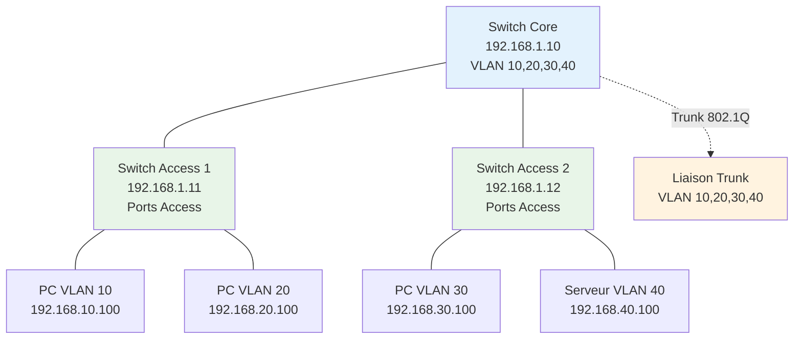

#### Étapes pas-à-pas

**Étape 1 : Configuration de l'environnement VLAN**

Configurez l'infrastructure de base avec support VLAN.

```bash
# Installation des outils réseau sur toutes les VMs
sudo apt update && sudo apt install -y \
    bridge-utils \
    vlan \
    tcpdump \
    iperf3 \
    net-tools \
    iproute2 \
    ethtool

# Activation du module VLAN
sudo modprobe 8021q
echo "8021q" | sudo tee -a /etc/modules

# Configuration persistante VLAN
sudo tee /etc/systemd/network/10-vlan.network << EOF
[Match]
Name=eth0

[Network]
DHCP=no
VLAN=vlan10
VLAN=vlan20
VLAN=vlan30
VLAN=vlan40
EOF
```

**Étape 2 : Configuration Switch Core (VM1)**

Implémentez un switch virtuel avec support VLAN complet.

```bash
# Configuration switch core avec Linux Bridge et VLAN
# /opt/vlan-switch/core-switch.sh

#!/bin/bash

# Création des bridges pour chaque VLAN
for vlan in 10 20 30 40; do
    sudo brctl addbr br-vlan$vlan
    sudo ip link set br-vlan$vlan up
    
    # Configuration IP pour routage inter-VLAN
    sudo ip addr add 192.168.$vlan.1/24 dev br-vlan$vlan
done

# Configuration bridge trunk principal
sudo brctl addbr br-trunk
sudo ip link set br-trunk up

# Script de gestion VLAN tagging
sudo tee /opt/vlan-switch/vlan-manager.py << 'EOF'
#!/usr/bin/env python3
"""
Gestionnaire VLAN pour switch Linux
Simule les fonctionnalités d'un switch manageable
"""

import subprocess
import json
import sys
from typing import Dict, List

class VLANManager:
    def __init__(self):
        self.vlans = {}
        self.ports = {}
        self.trunk_ports = []
        
    def create_vlan(self, vlan_id: int, name: str):
        """Crée un nouveau VLAN"""
        if vlan_id in self.vlans:
            print(f"VLAN {vlan_id} existe déjà")
            return False
        
        # Création du bridge VLAN
        bridge_name = f"br-vlan{vlan_id}"
        
        try:
            subprocess.run(['brctl', 'addbr', bridge_name], check=True)
            subprocess.run(['ip', 'link', 'set', bridge_name, 'up'], check=True)
            
            self.vlans[vlan_id] = {
                'name': name,
                'bridge': bridge_name,
                'ports': [],
                'status': 'active'
            }
            
            print(f"VLAN {vlan_id} ({name}) créé avec succès")
            return True
            
        except subprocess.CalledProcessError as e:
            print(f"Erreur création VLAN {vlan_id}: {e}")
            return False
    
    def assign_port_to_vlan(self, interface: str, vlan_id: int):
        """Assigne un port à un VLAN (mode access)"""
        if vlan_id not in self.vlans:
            print(f"VLAN {vlan_id} n'existe pas")
            return False
        
        bridge_name = self.vlans[vlan_id]['bridge']
        
        try:
            # Ajout de l'interface au bridge VLAN
            subprocess.run(['brctl', 'addif', bridge_name, interface], check=True)
            
            # Mise à jour des structures de données
            self.vlans[vlan_id]['ports'].append(interface)
            self.ports[interface] = {
                'mode': 'access',
                'vlan': vlan_id,
                'status': 'up'
            }
            
            print(f"Port {interface} assigné au VLAN {vlan_id}")
            return True
            
        except subprocess.CalledProcessError as e:
            print(f"Erreur assignation port {interface}: {e}")
            return False
    
    def configure_trunk_port(self, interface: str, allowed_vlans: List[int]):
        """Configure un port en mode trunk"""
        try:
            # Configuration du port trunk avec VLAN tagging
            for vlan_id in allowed_vlans:
                if vlan_id not in self.vlans:
                    continue
                
                # Création interface VLAN taguée
                vlan_interface = f"{interface}.{vlan_id}"
                subprocess.run(['ip', 'link', 'add', 'link', interface, 
                              'name', vlan_interface, 'type', 'vlan', 'id', str(vlan_id)], 
                              check=True)
                subprocess.run(['ip', 'link', 'set', vlan_interface, 'up'], check=True)
                
                # Ajout au bridge VLAN correspondant
                bridge_name = self.vlans[vlan_id]['bridge']
                subprocess.run(['brctl', 'addif', bridge_name, vlan_interface], check=True)
            
            # Mise à jour des structures
            self.ports[interface] = {
                'mode': 'trunk',
                'allowed_vlans': allowed_vlans,
                'status': 'up'
            }
            self.trunk_ports.append(interface)
            
            print(f"Port {interface} configuré en trunk pour VLAN {allowed_vlans}")
            return True
            
        except subprocess.CalledProcessError as e:
            print(f"Erreur configuration trunk {interface}: {e}")
            return False
    
    def show_vlan_brief(self):
        """Affiche un résumé des VLAN configurés"""
        print("\nVLAN Brief:")
        print("-" * 50)
        print(f"{'VLAN':<6} {'Name':<15} {'Status':<10} {'Ports'}")
        print("-" * 50)
        
        for vlan_id, vlan_info in sorted(self.vlans.items()):
            ports_str = ', '.join(vlan_info['ports'][:3])
            if len(vlan_info['ports']) > 3:
                ports_str += f" +{len(vlan_info['ports']) - 3} more"
            
            print(f"{vlan_id:<6} {vlan_info['name']:<15} {vlan_info['status']:<10} {ports_str}")
    
    def show_interfaces_trunk(self):
        """Affiche les interfaces trunk configurées"""
        print("\nTrunk Interfaces:")
        print("-" * 40)
        print(f"{'Port':<12} {'Mode':<8} {'Allowed VLANs'}")
        print("-" * 40)
        
        for interface, port_info in self.ports.items():
            if port_info['mode'] == 'trunk':
                allowed = ','.join(map(str, port_info['allowed_vlans']))
                print(f"{interface:<12} {'trunk':<8} {allowed}")
    
    def enable_inter_vlan_routing(self):
        """Active le routage inter-VLAN"""
        try:
            # Activation du forwarding IP
            subprocess.run(['sysctl', '-w', 'net.ipv4.ip_forward=1'], check=True)
            
            # Configuration persistante
            with open('/etc/sysctl.conf', 'a') as f:
                f.write('\nnet.ipv4.ip_forward=1\n')
            
            print("Routage inter-VLAN activé")
            return True
            
        except Exception as e:
            print(f"Erreur activation routage: {e}")
            return False
    
    def save_config(self, filename: str):
        """Sauvegarde la configuration"""
        config = {
            'vlans': self.vlans,
            'ports': self.ports,
            'trunk_ports': self.trunk_ports
        }
        
        with open(filename, 'w') as f:
            json.dump(config, f, indent=2)
        
        print(f"Configuration sauvegardée dans {filename}")

# Interface en ligne de commande
if __name__ == "__main__":
    manager = VLANManager()
    
    if len(sys.argv) < 2:
        print("Usage: vlan-manager.py <command> [args...]")
        print("Commands:")
        print("  create-vlan <id> <name>")
        print("  assign-port <interface> <vlan_id>")
        print("  trunk-port <interface> <vlan_list>")
        print("  show-vlans")
        print("  show-trunks")
        print("  enable-routing")
        sys.exit(1)
    
    command = sys.argv[1]
    
    if command == "create-vlan" and len(sys.argv) == 4:
        vlan_id = int(sys.argv[2])
        name = sys.argv[3]
        manager.create_vlan(vlan_id, name)
    
    elif command == "assign-port" and len(sys.argv) == 4:
        interface = sys.argv[2]
        vlan_id = int(sys.argv[3])
        manager.assign_port_to_vlan(interface, vlan_id)
    
    elif command == "trunk-port" and len(sys.argv) == 4:
        interface = sys.argv[2]
        vlan_list = [int(v) for v in sys.argv[3].split(',')]
        manager.configure_trunk_port(interface, vlan_list)
    
    elif command == "show-vlans":
        manager.show_vlan_brief()
    
    elif command == "show-trunks":
        manager.show_interfaces_trunk()
    
    elif command == "enable-routing":
        manager.enable_inter_vlan_routing()
    
    else:
        print("Commande invalide")
        sys.exit(1)
EOF

chmod +x /opt/vlan-switch/vlan-manager.py

# Configuration initiale des VLAN
python3 /opt/vlan-switch/vlan-manager.py create-vlan 10 "USERS"
python3 /opt/vlan-switch/vlan-manager.py create-vlan 20 "VOICE"
python3 /opt/vlan-switch/vlan-manager.py create-vlan 30 "SERVERS"
python3 /opt/vlan-switch/vlan-manager.py create-vlan 40 "MANAGEMENT"

# Activation routage inter-VLAN
python3 /opt/vlan-switch/vlan-manager.py enable-routing
```

**Étape 3 : Configuration des clients VLAN**

Configurez les clients dans différents VLAN.

```bash
# Client VLAN 10 (VM2)
# Configuration interface VLAN

sudo tee /etc/netplan/01-vlan-config.yaml << EOF
network:
  version: 2
  ethernets:
    eth0:
      dhcp4: no
  vlans:
    vlan10:
      id: 10
      link: eth0
      addresses:
        - 192.168.10.100/24
      gateway4: 192.168.10.1
      nameservers:
        addresses: [8.8.8.8, 1.1.1.1]
EOF

sudo netplan apply

# Vérification configuration VLAN
ip link show type vlan
ip addr show vlan10

# Test connectivité intra-VLAN
ping -c 3 192.168.10.1

# Client VLAN 20 (VM3) - Configuration similaire
sudo tee /etc/netplan/01-vlan-config.yaml << EOF
network:
  version: 2
  ethernets:
    eth0:
      dhcp4: no
  vlans:
    vlan20:
      id: 20
      link: eth0
      addresses:
        - 192.168.20.100/24
      gateway4: 192.168.20.1
      nameservers:
        addresses: [8.8.8.8, 1.1.1.1]
EOF

sudo netplan apply
```

**Étape 4 : Test de sécurité VLAN**

Implémentez des tests de sécurité pour vérifier l'isolation VLAN.

```python
#!/usr/bin/env python3
"""
Tests de sécurité VLAN
Vérifie l'isolation entre VLAN et détecte les vulnérabilités
"""

import subprocess
import socket
import struct
import time
import threading
from scapy.all import *

class VLANSecurityTester:
    def __init__(self, interface="eth0"):
        self.interface = interface
        self.test_results = []
        
    def test_vlan_isolation(self, src_vlan: int, dst_vlan: int, target_ip: str):
        """Test d'isolation entre VLAN"""
        print(f"Test isolation VLAN {src_vlan} -> VLAN {dst_vlan}")
        
        try:
            # Création paquet avec tag VLAN source
            packet = Ether()/Dot1Q(vlan=src_vlan)/IP(dst=target_ip)/ICMP()
            
            # Envoi et capture réponse
            response = srp1(packet, iface=self.interface, timeout=3, verbose=0)
            
            if response:
                result = {
                    'test': 'vlan_isolation',
                    'src_vlan': src_vlan,
                    'dst_vlan': dst_vlan,
                    'target': target_ip,
                    'status': 'FAILED',
                    'description': 'Isolation VLAN compromise - réponse reçue'
                }
            else:
                result = {
                    'test': 'vlan_isolation',
                    'src_vlan': src_vlan,
                    'dst_vlan': dst_vlan,
                    'target': target_ip,
                    'status': 'PASSED',
                    'description': 'Isolation VLAN correcte - aucune réponse'
                }
            
            self.test_results.append(result)
            return result
            
        except Exception as e:
            print(f"Erreur test isolation: {e}")
            return None
    
    def test_vlan_hopping_double_tag(self, outer_vlan: int, inner_vlan: int, target_ip: str):
        """Test d'attaque VLAN hopping par double tagging"""
        print(f"Test VLAN hopping double tag: {outer_vlan}/{inner_vlan}")
        
        try:
            # Création paquet avec double tag
            packet = Ether()/Dot1Q(vlan=outer_vlan)/Dot1Q(vlan=inner_vlan)/IP(dst=target_ip)/ICMP()
            
            # Envoi et analyse
            response = srp1(packet, iface=self.interface, timeout=3, verbose=0)
            
            if response:
                result = {
                    'test': 'double_tag_hopping',
                    'outer_vlan': outer_vlan,
                    'inner_vlan': inner_vlan,
                    'target': target_ip,
                    'status': 'VULNERABLE',
                    'description': 'Vulnérable au VLAN hopping par double tagging'
                }
            else:
                result = {
                    'test': 'double_tag_hopping',
                    'outer_vlan': outer_vlan,
                    'inner_vlan': inner_vlan,
                    'target': target_ip,
                    'status': 'PROTECTED',
                    'description': 'Protégé contre le VLAN hopping par double tagging'
                }
            
            self.test_results.append(result)
            return result
            
        except Exception as e:
            print(f"Erreur test double tagging: {e}")
            return None
    
    def test_dtp_manipulation(self):
        """Test de manipulation DTP (Dynamic Trunking Protocol)"""
        print("Test manipulation DTP")
        
        try:
            # Simulation paquet DTP pour forcer mode trunk
            # Note: Implémentation simplifiée pour démonstration
            dtp_packet = Ether(dst="01:00:0c:cc:cc:cc")/Raw(load=b'\x01\x00\x0c\x00\x00')
            
            # Envoi paquet DTP
            sendp(dtp_packet, iface=self.interface, verbose=0)
            
            # Attente et vérification changement mode
            time.sleep(5)
            
            # Vérification si interface est passée en mode trunk
            # (Nécessiterait analyse plus poussée en environnement réel)
            
            result = {
                'test': 'dtp_manipulation',
                'status': 'TESTED',
                'description': 'Test DTP effectué - vérification manuelle requise'
            }
            
            self.test_results.append(result)
            return result
            
        except Exception as e:
            print(f"Erreur test DTP: {e}")
            return None
    
    def test_native_vlan_attack(self, native_vlan: int, target_vlan: int, target_ip: str):
        """Test d'attaque via Native VLAN"""
        print(f"Test attaque Native VLAN {native_vlan} -> VLAN {target_vlan}")
        
        try:
            # Paquet sans tag (utilise Native VLAN)
            untagged_packet = Ether()/IP(dst=target_ip)/ICMP()
            
            # Paquet avec tag du VLAN cible
            tagged_packet = Ether()/Dot1Q(vlan=target_vlan)/IP(dst=target_ip)/ICMP()
            
            # Test des deux approches
            response1 = srp1(untagged_packet, iface=self.interface, timeout=3, verbose=0)
            response2 = srp1(tagged_packet, iface=self.interface, timeout=3, verbose=0)
            
            if response1 and response2:
                result = {
                    'test': 'native_vlan_attack',
                    'native_vlan': native_vlan,
                    'target_vlan': target_vlan,
                    'status': 'VULNERABLE',
                    'description': 'Native VLAN permet accès non autorisé'
                }
            else:
                result = {
                    'test': 'native_vlan_attack',
                    'native_vlan': native_vlan,
                    'target_vlan': target_vlan,
                    'status': 'PROTECTED',
                    'description': 'Native VLAN correctement configuré'
                }
            
            self.test_results.append(result)
            return result
            
        except Exception as e:
            print(f"Erreur test Native VLAN: {e}")
            return None
    
    def scan_vlan_range(self, vlan_range: range, target_network: str):
        """Scan d'une plage de VLAN pour découverte"""
        print(f"Scan VLAN range {vlan_range.start}-{vlan_range.stop}")
        
        discovered_vlans = []
        
        for vlan_id in vlan_range:
            try:
                # Test ping sur réseau avec tag VLAN
                target_ip = target_network.replace('0', '1')  # Gateway probable
                packet = Ether()/Dot1Q(vlan=vlan_id)/IP(dst=target_ip)/ICMP()
                
                response = srp1(packet, iface=self.interface, timeout=1, verbose=0)
                
                if response:
                    discovered_vlans.append(vlan_id)
                    print(f"  VLAN {vlan_id} découvert")
                
            except Exception:
                continue
        
        result = {
            'test': 'vlan_discovery',
            'discovered_vlans': discovered_vlans,
            'total_discovered': len(discovered_vlans),
            'status': 'COMPLETED'
        }
        
        self.test_results.append(result)
        return result
    
    def generate_security_report(self):
        """Génère un rapport de sécurité VLAN"""
        report = []
        report.append("="*60)
        report.append("RAPPORT DE SÉCURITÉ VLAN")
        report.append("="*60)
        report.append(f"Interface testée: {self.interface}")
        report.append(f"Nombre de tests: {len(self.test_results)}")
        report.append("")
        
        # Résumé des vulnérabilités
        vulnerabilities = [r for r in self.test_results if r.get('status') in ['FAILED', 'VULNERABLE']]
        report.append(f"Vulnérabilités détectées: {len(vulnerabilities)}")
        report.append("")
        
        # Détail des tests
        for result in self.test_results:
            report.append(f"Test: {result['test']}")
            report.append(f"Statut: {result['status']}")
            report.append(f"Description: {result['description']}")
            
            # Détails spécifiques selon le test
            if 'src_vlan' in result:
                report.append(f"VLAN source: {result['src_vlan']}")
                report.append(f"VLAN destination: {result['dst_vlan']}")
            
            if 'discovered_vlans' in result:
                report.append(f"VLAN découverts: {result['discovered_vlans']}")
            
            report.append("-" * 40)
        
        return "\n".join(report)

# Utilisation des tests de sécurité
if __name__ == "__main__":
    tester = VLANSecurityTester("eth0")
    
    print("Démarrage des tests de sécurité VLAN...")
    
    # Test 1: Isolation entre VLAN
    tester.test_vlan_isolation(10, 20, "192.168.20.100")
    tester.test_vlan_isolation(20, 30, "192.168.30.100")
    
    # Test 2: VLAN hopping par double tagging
    tester.test_vlan_hopping_double_tag(1, 10, "192.168.10.100")
    tester.test_vlan_hopping_double_tag(1, 20, "192.168.20.100")
    
    # Test 3: Attaque Native VLAN
    tester.test_native_vlan_attack(1, 10, "192.168.10.100")
    
    # Test 4: Découverte VLAN
    tester.scan_vlan_range(range(1, 50), "192.168.0.0")
    
    # Test 5: Manipulation DTP
    tester.test_dtp_manipulation()
    
    # Génération rapport
    report = tester.generate_security_report()
    
    # Sauvegarde
    with open('/tmp/vlan_security_report.txt', 'w') as f:
        f.write(report)
    
    print("\nTests terminés. Rapport sauvegardé dans /tmp/vlan_security_report.txt")
    print("\nRésumé:")
    print(report[:500] + "...")
```

#### Vérification

```bash
# Vérification configuration VLAN
ip link show type vlan
bridge vlan show

# Test connectivité intra-VLAN
ping -c 3 192.168.10.1  # Depuis client VLAN 10

# Test isolation inter-VLAN (doit échouer)
ping -c 3 192.168.20.100  # Depuis VLAN 10 vers VLAN 20

# Test routage inter-VLAN (doit réussir si configuré)
ping -c 3 192.168.30.100  # Via routeur

# Analyse trafic VLAN
sudo tcpdump -i eth0 -nn vlan

# Vérification tables de commutation
brctl show
brctl showmacs br-vlan10

# Test performance inter-VLAN
iperf3 -s &  # Sur serveur VLAN 30
iperf3 -c 192.168.30.100  # Depuis client VLAN 10
```

#### Résultats attendus
- Isolation complète entre VLAN sans routage
- Routage inter-VLAN fonctionnel via passerelles
- Protection contre attaques VLAN hopping
- Trunking 802.1Q opérationnel
- Monitoring et audit automatisés

### Auto-évaluation (QCM – 10 questions)

| # | Question | A | B | C | D |
|---|----------|---|---|---|---|
| 1 | Un VLAN permet principalement de : | Augmenter la bande passante | Segmenter logiquement le réseau | Chiffrer les communications | Compresser les données |
| 2 | Le standard 802.1Q utilise : | 8 bits pour l'ID VLAN | 12 bits pour l'ID VLAN | 16 bits pour l'ID VLAN | 24 bits pour l'ID VLAN |
| 3 | Le Native VLAN transporte : | Toutes les trames | Les trames taguées | Les trames non-taguées | Les trames de gestion |
| 4 | Un port trunk permet : | Un seul VLAN | Plusieurs VLAN | Aucun VLAN | Les VLAN de gestion uniquement |
| 5 | Le VLAN hopping exploite : | Les mots de passe faibles | La configuration des ports | Les protocoles de routage | Le chiffrement |
| 6 | SVI signifie : | Switch VLAN Interface | Switch Virtual Interface | Secure VLAN Implementation | Standard VLAN Identifier |
| 7 | DTP est utilisé pour : | Chiffrer les VLAN | Router entre VLAN | Négocier le trunking | Compresser les trames |
| 8 | Un Private VLAN permet : | Plus de 4094 VLAN | Isolation intra-VLAN | Routage plus rapide | Chiffrement automatique |
| 9 | Le Voice VLAN sert à : | Isoler la téléphonie IP | Augmenter la sécurité | Réduire la latence générale | Compresser la voix |
| 10 | LACP est un protocole pour : | L'authentification VLAN | L'agrégation de liens | Le routage VLAN | La sécurité des ports |

**Corrigé :** 1-B, 2-B, 3-C, 4-B, 5-B, 6-B, 7-C, 8-B, 9-A, 10-B

**Explications :**

1. **Segmenter logiquement le réseau** : Les VLAN créent des domaines de broadcast séparés indépendamment de la topologie physique.

2. **12 bits pour l'ID VLAN** : Le standard 802.1Q utilise 12 bits pour l'identifiant VLAN, permettant 4094 VLAN (0 et 4095 réservés).

3. **Les trames non-taguées** : Le Native VLAN transporte les trames sans tag 802.1Q sur les liaisons trunk.

4. **Plusieurs VLAN** : Un port trunk peut transporter le trafic de multiples VLAN via l'encapsulation 802.1Q.

5. **La configuration des ports** : Le VLAN hopping exploite les mauvaises configurations de ports (DTP, Native VLAN, etc.).

6. **Switch Virtual Interface** : SVI est une interface logique associée à un VLAN pour le routage inter-VLAN.

7. **Négocier le trunking** : DTP (Dynamic Trunking Protocol) négocie automatiquement les paramètres de trunking entre switches.

8. **Isolation intra-VLAN** : Les Private VLAN permettent l'isolation de ports au sein d'un même VLAN traditionnel.

9. **Isoler la téléphonie IP** : Les Voice VLAN séparent le trafic vocal pour appliquer des politiques QoS spécifiques.

10. **L'agrégation de liens** : LACP (Link Aggregation Control Protocol) gère l'agrégation de multiples liaisons physiques.

### Synthèse visuelle

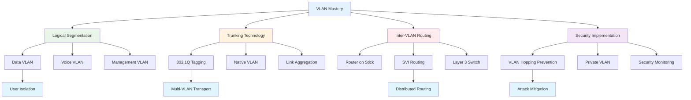

### Points clés à retenir

**Virtualisation intelligente de la couche 2** : Les VLAN révolutionnent l'architecture réseau en permettant la création de domaines de broadcast logiques indépendants de la topologie physique, offrant flexibilité, sécurité et efficacité impossibles avec la segmentation physique traditionnelle.

**Trunking et optimisation du transport** : Le protocole 802.1Q et l'agrégation de liens créent une infrastructure de transport efficace pour multiples VLAN, optimisant l'utilisation des liaisons physiques tout en maintenant l'isolation logique nécessaire.

**Sécurité proactive et défense en profondeur** : La protection contre les attaques VLAN hopping, l'implémentation de Private VLAN et la surveillance continue constituent des éléments essentiels pour maintenir l'intégrité sécuritaire des architectures VLAN modernes.

---

